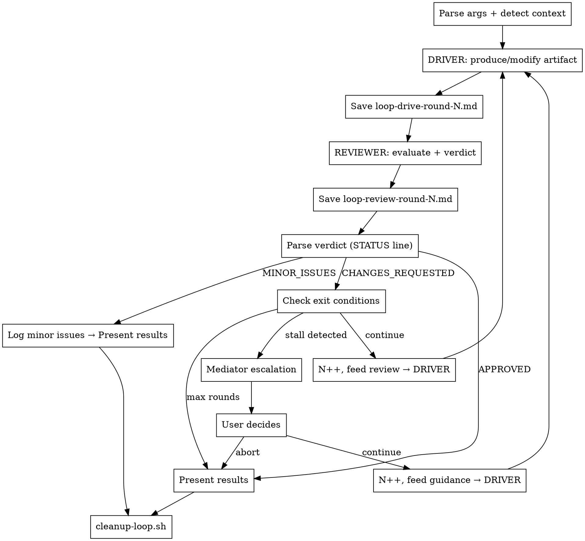

# Collaborative Loop: Sequential Claude x Codex CLI

## Overview

Sequential drive-review loop between Claude and Codex CLI. Each round: DRIVER produces/modifies artifact → REVIEWER evaluates and delivers a structured verdict → repeat until APPROVED, stalled, or max rounds reached. Unlike cross-review (parallel independent reviews), this is a **conversation** where each model builds on the other's feedback.

## Prerequisites

- Codex CLI installed: `npm install -g @openai/codex`
- Codex authenticated: `codex auth login`
- Config at `~/.codex/config.toml` with model and approval mode:

```toml
# ~/.codex/config.toml (example — adjust model to your available version)
model = "gpt-5.4"
model_reasoning_effort = "xhigh"
```

## Checklist

Execute each of these steps sequentially, completing one before moving to the next:

1. **Parse arguments and detect context** — set DRIVER/REVIEWER roles, detect artifact type, identify target files
2. **Driver produces/modifies artifact** — Claude skill discovery (round 1) or direct edits (round N>1), or Codex drive script
3. **Reviewer evaluates with structured verdict** — Claude subagent or Codex review script
4. **Parse verdict and check exit conditions** — APPROVED? MINOR_ISSUES? stall? max rounds?
5. **Mediator escalation (if stalled)** — present stalled items, get user guidance
6. **Present results summary** — final state, resolved issues, remaining items
7. **Clean up intermediate files** — run `bash "${CLAUDE_PLUGIN_ROOT}/scripts/cleanup-loop.sh" docs/plans/collaborative-loop` (mandatory)

## Core Workflow



## Step 1: Parse Arguments and Detect Context

### Argument Parsing

Parse the user's invocation. Defaults in parentheses:

| Argument | Default | Description |
|----------|---------|-------------|
| `--driver` | `claude` | Who drives: `claude` or `codex` |
| `--max-rounds` | `5` | Maximum iteration rounds |
| `--task` | (from user message) | Task description for the driver |
| target files | (current branch diff) | Specific files to work on |

If no target files specified:
1. Detect base branch: check for `main`, then `master`
2. Run `git diff <base>...HEAD --name-only` to find changed files
3. If no changes found, ask the user what to work on

### Artifact Type Detection

Examine the target file(s) to classify:

| Signal | Artifact Type |
|--------|---------------|
| `*-plan*.md`, `*implementation-plan*`, `*-tasks*` | **plan** |
| `*-design*.md`, `*-architecture*`, `*-spec*` | **architecture** |
| `*.cs`, `*.ts`, `*.py`, `*.js`, `*.go`, `*.rs`, `*.java` (source files) | **code** |
| Other `*.md` in `docs/` or `plans/` | **design** |

Mixed artifacts (e.g., code + docs) → prioritize **code**.

Set `ARTIFACT_TYPE`, `DRIVER` (claude|codex), `REVIEWER` (the other), `MAX_ROUNDS`, and `TARGET_FILES`.

### Initialize State

```
ROUND = 1
STALL_COUNT = 0
PREV_FINDINGS = []  (empty — tracked internally, not persisted to files)
```

Create output directory:
```bash
mkdir -p docs/plans/collaborative-loop
```

## Step 2: Driver Produces/Modifies Artifact

### When Claude is Driver

**Round 1 — Skill Discovery:**
Search available skills for the best match based on `ARTIFACT_TYPE`:

| Artifact Type | Search Keywords |
|---------------|-----------------|
| **plan** | `writing-plans`, `executing-plans`, `plan` |
| **architecture** | `architect`, `architecture`, `brainstorming`, `design` |
| **code** | `coder`, `code-review`, `implementation`, `feature-dev` (prefer project-specific) |
| **design** | `brainstorming`, `writing-plans`, `design` |

Priority: project-specific skills first → general-purpose skills second → direct edits if no skill found.

Invoke the discovered skill with the task description and target files. After the skill completes, capture a summary of what was done in `docs/plans/collaborative-loop/loop-drive-round-1.md`.

**Round N > 1 — Direct Edits:**
Read the latest review file (`docs/plans/collaborative-loop/loop-review-round-{N-1}.md`). Apply each finding directly:
- Address findings in severity order (critical → high → medium → minor)
- Use Edit tool for precise changes
- Do not refactor beyond what's needed to address findings
- Save summary to `docs/plans/collaborative-loop/loop-drive-round-N.md`

Drive round summary format:
```markdown
# Drive Round N

## Task
<original task or "Apply reviewer feedback from round N-1">

## Changes Applied
- [finding ref] description of change

## Findings Declined (if any)
- [finding ref] reason

## Files Modified
- path/to/file1
- path/to/file2
```

### When Codex is Driver

Run the drive script as a **background bash process** (`run_in_background: true`):

```bash
bash "${CLAUDE_PLUGIN_ROOT}/scripts/run-codex-drive.sh" <ARTIFACT_TYPE> <ROUND> docs/plans/collaborative-loop /path/to/project <feedback_file> [target_files...]
```

- Round 1: `feedback_file` = `none`
- Round N > 1: `feedback_file` = `docs/plans/collaborative-loop/loop-review-round-{N-1}.md`

Wait for the background task to complete using TaskOutput. Then verify the output file exists and has content. If the file is empty or missing, reconstruct from TaskOutput (the script uses `tee`).

## Step 3: Reviewer Evaluates with Structured Verdict

### When Claude is Reviewer

Launch a subagent to review the driver's changes:

```
Agent tool with:
  - subagent_type: "general-purpose"
  - model: "opus"
  - run_in_background: false  (sequential — we need the result before proceeding)
  - prompt: |
      You are reviewing changes made by the driver (Codex) in a collaborative loop.
      This is Round N.

      ## Task Context
      <original task description>

      ## Driver's Changes
      <content of loop-drive-round-N.md or git diff summary>

      ## Target Files
      <file list>

      <If Round N > 1:>
      ## Previous Review (Round N-1)
      <content of loop-review-round-{N-1}.md>
      Only evaluate NEW changes. Do not re-report issues that were fixed.
      </If>

      <verdict-format.txt content>

      Review the driver's work and produce a verdict following the format above exactly.
```

Save the subagent's output to `docs/plans/collaborative-loop/loop-review-round-N.md`.

### When Codex is Reviewer

Run the review script as a **background bash process** (`run_in_background: true`):

**For code artifacts:**
```bash
bash "${CLAUDE_PLUGIN_ROOT}/scripts/run-codex-review.sh" code <ROUND> docs/plans/collaborative-loop /path/to/project <base_branch>
```

**For non-code artifacts:**
```bash
bash "${CLAUDE_PLUGIN_ROOT}/scripts/run-codex-review.sh" <plan|architecture|design> <ROUND> docs/plans/collaborative-loop /path/to/project [target_files...]
```

Wait for the background task to complete using TaskOutput. Verify the output file:
- Read `docs/plans/collaborative-loop/loop-review-round-N.md`
- Confirm it contains `STATUS:` line and structured findings
- If file is truncated/empty, reconstruct from TaskOutput (the script uses `tee`)

**For code round 1:** The script uses `codex review --base` which has its own output format (no verdict template). Parse the output to extract findings and synthesize a verdict:
- If no critical/high/medium findings → `STATUS: APPROVED`
- If only minor findings → `STATUS: MINOR_ISSUES`
- Otherwise → `STATUS: CHANGES_REQUESTED`

Rewrite the review file with proper verdict format if needed.

## Step 4: Parse Verdict and Check Exit Conditions

### Verdict Parsing

Scan the review file for the `STATUS:` line:

```
grep -i "^STATUS:" docs/plans/collaborative-loop/loop-review-round-N.md
```

Extract the verdict:
- `APPROVED` → Step 6 (present results)
- `MINOR_ISSUES` → log the minor items, then Step 6 (present results)
- `CHANGES_REQUESTED` → continue to exit condition checks
- Missing or malformed → treat as `CHANGES_REQUESTED`

### Stall Detection

Extract current round's findings (file:line + description tuples). Compare with `PREV_FINDINGS`:
- Count findings that persist (same file, same issue — fuzzy match on description)
- If > 50% of findings persist from the previous round, increment `STALL_COUNT`
- If `STALL_COUNT >= 2` → mediator escalation (Step 5)

Update `PREV_FINDINGS` with current round's findings.

### Exit Condition Checks (in order)

1. **Stall detected** (`STALL_COUNT >= 2`) → Step 5 (mediator)
2. **Max rounds reached** (`ROUND >= MAX_ROUNDS`) → Step 6 with remaining issues
3. **Otherwise** → increment `ROUND`, feed review to driver, back to Step 2

## Step 5: Mediator Escalation

When stall is detected (same findings persist across 2+ rounds despite fixes):

### Present to User

```markdown
## Mediator Needed — Collaboration Stalled

**Round:** N | **Stall count:** 2 | **Persistent findings:** X

The following issues have persisted across multiple drive-review cycles:

### Stalled Finding 1
- **Issue:** <description>
- **Driver's position:** <what driver did/argued>
- **Reviewer's position:** <what reviewer keeps flagging>
- **History:** Flagged round M, attempted fix round M+1, re-flagged round M+2

### Stalled Finding 2
...

**Options:**
1. **Accept driver's approach** — tell reviewer to stop flagging these items
2. **Side with reviewer** — provide specific guidance for how to fix
3. **Your own direction** — provide alternative approach
4. **Abort** — stop the loop, keep current state
```

### After User Decides

- If user provides guidance: feed it as **authoritative context** to the next driver round (non-negotiable — driver must follow)
- Tell the reviewer in the next round: "The following items were settled by the user and must NOT be re-flagged: <list>"
- Reset `STALL_COUNT` to 0
- Continue the loop

If user chooses abort → Step 6 (present results).

## Step 6: Present Results Summary

```markdown
## Collaborative Loop Complete

**Driver:** <claude|codex> | **Reviewer:** <claude|codex>
**Rounds:** N | **Max rounds:** M
**Exit reason:** <approved | minor issues only | max rounds | stall → user decision | abort>

### Final Verdict
<last reviewer verdict>

### Resolved Issues (across all rounds)
- Round 1→2: <issues fixed>
- Round 2→3: <issues fixed>
- ...

### Remaining Issues (if any)
<unresolved findings from last review>

### User Decisions Made (if any)
<mediator outcomes>
```

## Step 7: Clean Up Intermediate Files (MANDATORY)

Run the cleanup script — this is MANDATORY regardless of exit reason:

```bash
bash "${CLAUDE_PLUGIN_ROOT}/scripts/cleanup-loop.sh" docs/plans/collaborative-loop
```

**Do NOT delete** the target artifact files that were worked on — only the loop round files.
**Do NOT skip this step** — leaving intermediate files is a known failure mode.

## Iteration Rules

- **Max 5 rounds** default — override with `--max-rounds`
- **Sequential, not parallel** — driver completes before reviewer starts, reviewer completes before next driver round
- **Each round produces 2 files:** `loop-drive-round-N.md`, `loop-review-round-N.md`
- **All intermediate files are deleted** after the loop completes (Step 7 — mandatory)
- **Context is minimal** — each agent receives only the latest review, not full history
- **Stall detection compares adjacent rounds** — findings that persist across 2+ rounds trigger mediator
- **User guidance is authoritative** — once the user decides on a stalled item, it's settled
- **Verdict format is enforced** — if Codex doesn't use it (e.g., `codex review --base`), synthesize one from the output

## Common Mistakes

- **Running driver and reviewer in parallel** — this is a SEQUENTIAL loop; driver must finish before reviewer starts. The whole point is that the reviewer evaluates the driver's actual output
- **Passing full round history to agents** — each agent gets ONLY the most recent review file. The orchestrator tracks state internally
- **Forgetting to synthesize verdict for `codex review --base` output** — round 1 code review with Codex uses `codex review` which has its own format; you must parse it and produce a verdict
- **Not detecting stall** — if you don't track findings across rounds, the loop can spin forever on the same issues
- **Silently resolving stalled items** — stall resolution requires user input; never auto-resolve
- **Skipping skill discovery on round 1** — when Claude drives, round 1 should use the best available skill for the artifact type, not just raw edits
- **Using skill discovery on round N > 1** — after round 1, Claude driver should apply feedback directly with Edit tool, not re-invoke skills
- **Leaving intermediate files** — always run `cleanup-loop.sh` regardless of exit reason
- **Running Codex scripts without `run_in_background`** — Codex commands can take minutes; always run as background tasks and wait via TaskOutput
- **Passing both `--base` and a prompt to `codex review`** — they are mutually exclusive in Codex CLI; the review script handles this correctly
- **Not verifying Codex output files** — always read the output file after TaskOutput completes; reconstruct from TaskOutput if file is empty/truncated (script uses `tee`)
- **Treating MINOR_ISSUES as CHANGES_REQUESTED** — MINOR_ISSUES means the loop should stop; log the items but don't iterate further
- **Ignoring user's --driver flag** — if user specifies `--driver codex`, Codex drives and Claude reviews; don't override
- **Feeding user mediator guidance as a suggestion** — user decisions are authoritative and non-negotiable for both driver and reviewer
- **Responding to late background task notifications** — if a Codex background task completion arrives after the workflow has finished, do NOT generate a user-facing response; silently acknowledge it
