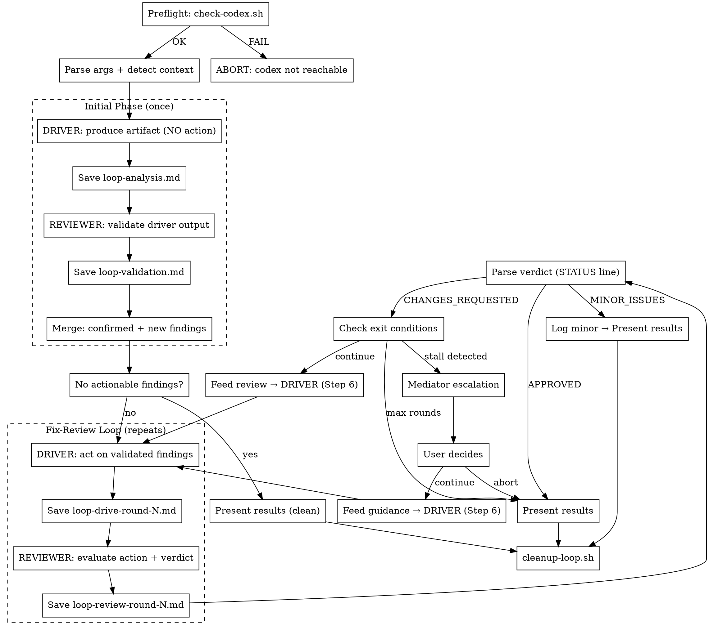

# Collaborative Loop: Sequential Claude x Codex CLI

## Overview

Pair-programming loop between Claude and Codex CLI. The driver PRODUCES an artifact (analysis, review, code, plan) → the reviewer VALIDATES the driver's output before any action is taken → the driver ACTS only on validated findings → the reviewer evaluates the action → repeat until clean.

**Key principle: the driver never acts on its own unvalidated output.** Every analysis is validated by the other model before implementation. This prevents false-positive fixes and wasted iterations.

## Prerequisites

- Codex CLI installed: `npm install -g @openai/codex`
- Codex authenticated: `codex auth login`
- Config at `~/.codex/config.toml` with model and approval mode:

```toml
# ~/.codex/config.toml (example — adjust model to your available version)
model = "gpt-5.4"
model_reasoning_effort = "xhigh"

# Native subagent support (on by default — only needed if explicitly disabled)
[features]
multi_agent = true

[agents]
max_threads = 6   # concurrent subagent cap (default: 6, our heuristic uses ≤ 3)
max_depth = 1     # no nested subagent spawning (default)
```

### Platform Notes

- **MINGW/MSYS (Git Bash on Windows):** Codex runs via WSL. The preflight check verifies WSL is available and codex is installed inside it. All codex invocations are transparently routed through `wsl --cd <path> -- codex`.
- **WSL:** Codex runs directly. Just needs `codex` in PATH.
- **Linux/macOS:** Codex runs directly.

## Checklist

Execute each of these steps sequentially, completing one before moving to the next:

1. **Preflight check** — verify codex is reachable before any work begins; ABORT if not
2. **Parse arguments and detect context** — set DRIVER/REVIEWER roles, detect artifact type, identify target files, decompose for parallel subagents
3. **Driver PRODUCES initial artifact** — analysis, review, draft, or code (NO fixes, NO implementation of own findings); spawn multiple subagents if decomposed
4. **Reviewer VALIDATES driver's output** — confirm/reject each finding, add missed findings
5. **Merge validated findings** — combine confirmed + new findings; check if action is needed
6. **Driver ACTS on validated findings only** — implement fixes or refinements
7. **Reviewer evaluates action with structured verdict** — standard review of what the driver changed
8. **Parse verdict and check exit conditions** — APPROVED? MINOR_ISSUES? stall? max rounds?
9. **Mediator escalation (if stalled)** — present stalled items, get user guidance
10. **Present results summary** — final state, resolved issues, remaining items
11. **Clean up intermediate files** — run `bash "${CLAUDE_PLUGIN_ROOT}/scripts/cleanup-loop.sh" docs/plans/collaborative-loop` (mandatory)

## Core Workflow



## Step 1: Preflight Check

**Run this BEFORE any other work.** If the check fails, ABORT immediately — do not parse arguments, detect context, or start any loop work.

```bash
bash "${CLAUDE_PLUGIN_ROOT}/scripts/check-codex.sh"
```

The script detects the environment and validates codex reachability:

| Environment | Detection | How codex runs |
|-------------|-----------|----------------|
| **MINGW/MSYS** | `uname -s` starts with `MINGW` or `MSYS` | Via WSL: `wsl --cd <wsl_path> -- codex` |
| **WSL** | `WSL_DISTRO_NAME` is set or `/proc/version` contains "Microsoft" | Directly: `codex` |
| **Native** | Everything else (Linux, macOS) | Directly: `codex` |

**On success:** prints `OK: ...` to stderr and `CODEX_ENV=<env>` to stdout. Proceed to Step 2.
**On failure:** prints `FAIL: ...` with install instructions. **STOP HERE** — tell the user what's missing and how to fix it. Do not continue.

The shell scripts (`run-codex-drive.sh`, `run-codex-review.sh`, `run-codex-validate.sh`) source this script internally and use `codex_run` instead of bare `codex`, so WSL path translation is handled transparently.

## Step 2: Parse Arguments and Detect Context

### Argument Parsing

Parse the user's invocation. Defaults in parentheses:

| Argument | Default | Description |
|----------|---------|-------------|
| `--driver` | `claude` | Who drives: `claude` or `codex` |
| `--max-rounds` | `5` | Maximum fix-review iteration rounds |
| `--task` | (from user message; inferred from branch name + commits if bare) | Task description for the driver |
| target files | (current branch diff) | Specific files to work on |

### Default Mode (No Arguments) — MANDATORY

**When invoked without arguments, you MUST apply all defaults from the table above and start immediately. NEVER ask clarifying questions — infer and proceed.** Use ALL files from the branch diff regardless of count. Infer the task from branch name and commit messages (e.g., branch `story/151-parser-progress` → "Review and improve the parser progress calculation changes"; generic branch like `main` → "Review and improve the changed files").

If no target files specified:
1. Detect base branch: check for `main`, then `master`
2. Run `git diff <base>...HEAD --name-only` to find changed files
3. If no changes found (zero files in diff), this is the ONLY case where you may ask the user what to work on

### Artifact Type Detection

Examine the target file(s) to classify:

| Signal | Artifact Type |
|--------|---------------|
| `*-plan*.md`, `*implementation-plan*`, `*-tasks*` | **plan** |
| `*-design*.md`, `*-architecture*`, `*-spec*` | **architecture** |
| `*.cs`, `*.ts`, `*.py`, `*.js`, `*.go`, `*.rs`, `*.java` (source files) | **code** |
| Other `*.md` in `docs/` or `plans/` | **design** |

Mixed artifacts (e.g., code + docs) → prioritize **code**.

Set `ARTIFACT_TYPE`, `DRIVER` (claude|codex), `REVIEWER` (the other), `MAX_ROUNDS`, and `TARGET_FILES`.

### Initialize State

```
ROUND = 0  (fix-review rounds start at 1; initial phase is round 0)
STALL_COUNT = 0
PREV_FINDINGS = []  (empty — tracked internally, not persisted to files)
```

Create output directory:
```bash
mkdir -p docs/plans/collaborative-loop
```

## Parallel Subagent Strategy

The orchestrator decides how many subagents to spawn for each phase based on the task's decomposability. This applies to all phases (analysis, validation, fix, review) and both Claude and Codex subagents. The driver role determines the default judgment, but the orchestrator always makes the final call.

### Decomposition Decision (performed once, after Step 2)

1. **Group files by module** — cluster `TARGET_FILES` by their top-level directory (e.g., `src/auth/*`, `src/api/*`, `lib/utils/*`)
2. **Apply the split heuristic:**

| Files | Directory Groups | Subagents | Rationale |
|-------|-----------------|-----------|-----------|
| ≤ 3   | any             | 1         | Overhead exceeds benefit |
| 4–8   | 2–3             | 2         | Moderate parallelism |
| 9+    | 3+              | up to 3   | Maximum practical parallelism |
| any   | 1               | 1         | Single module — no natural split point |

**Hard cap: 3 subagents.** Coordination overhead dominates beyond this.

3. **Assign file groups to subagents** — each subagent gets one or more directory groups. Never split files from the same directory across different subagents.

Store the decomposition alongside other state:
```
SUBAGENT_COUNT = <1|2|3>
CHUNKS = [ [chunk_1_files...], [chunk_2_files...], ... ]
```

**Refresh after modifying rounds:** After each fix round (Step 6), check if the driver created, renamed, or deleted files. If `TARGET_FILES` changed, re-run decomposition to update `CHUNKS`. New files are assigned to the directory group they belong to; if they form a new group, add it to the nearest chunk. This prevents unreviewed files from falling outside all chunks.

### When to Force Single Subagent

Always use `SUBAGENT_COUNT = 1` regardless of file count when:
- Fix rounds (Step 6) where findings cross-reference multiple file groups
- Validation (Step 4) with fewer than 5 total findings
- Task explicitly requires holistic analysis (e.g., "review the overall architecture")
- Code reviews with Codex using `codex review --base` (reviews the entire branch diff — cannot be file-scoped; the `--chunk` fallback only changes the output filename, not what gets reviewed, producing duplicate findings across chunks)
- Codex plan concurrent task limit would be exceeded (Pro: 3 concurrent, Plus: 1, Team: 2) — if already running N Codex tasks and spawning more would exceed the limit, reduce `SUBAGENT_COUNT` accordingly

### Spawning Multiple Subagents

Both Claude Code and Codex have **native subagent systems**. Always use the native mechanism — never spawn multiple raw CLI sessions.

**Claude Code** — use multiple `Agent` tool calls in a **single response**, all with `run_in_background: true`. Name each distinctly (e.g., `"analysis-chunk-1"`, `"review-chunk-2"`). Wait for all to complete via TaskOutput before proceeding. This IS the native Claude Code subagent system.

Example — 2 parallel Claude reviewer subagents:
```
Agent tool call 1:
  - name: "review-chunk-1"
  - run_in_background: true
  - prompt: "Review files: src/auth/login.ts, src/auth/session.ts ..."

Agent tool call 2:
  - name: "review-chunk-2"
  - run_in_background: true
  - prompt: "Review files: src/api/routes.ts, src/api/middleware.ts ..."
```

**Codex** — run a **single** `codex exec` session whose prompt instructs Codex to use its **native subagent system** (`spawn_agent`/`wait_agent`, enabled by default via `features.multi_agent = true`). Codex internally spawns parallel threads (up to `agents.max_threads`, default 6), waits for all results, and returns a **consolidated response**. Do NOT spawn multiple `codex exec` CLI sessions — that causes session-state interference (Issue #11435) and bypasses Codex's built-in result consolidation.

Example — Codex prompt with native subagent instructions:
```
Analyze the following code changes for quality and correctness.

Parallelize this work using subagents — spawn one subagent per file group,
wait for all of them, and consolidate the findings:

Group 1: src/auth/login.ts, src/auth/session.ts
Group 2: src/api/routes.ts, src/api/middleware.ts

For each group, analyze files and report findings in this format:
[severity: critical|high|medium|minor] [category] File:line — description
  Suggested fix: <concrete fix>

After all subagents complete, merge all findings into a single numbered list,
deduplicate any overlapping findings, and provide a consolidated summary.
```

The scripts (`run-codex-drive.sh`, `run-codex-review.sh`, `run-codex-validate.sh`) handle **single-session, single-agent execution only**. They build prompts from fixed template files and cannot inject subagent spawning instructions. When `SUBAGENT_COUNT > 1` and using native Codex subagents, the orchestrator **must bypass the scripts** and run `codex_run exec --full-auto --ephemeral` inline with a prompt that includes both the task and subagent instructions. The `--chunk` flag on scripts is a **fallback** for environments where Codex's native subagent system is unavailable — it runs multiple separate CLI sessions (one per chunk) instead of a single session with internal subagents.

### Merging Parallel Results

**Codex native subagents:** Codex consolidates results automatically within the session. The output from `codex exec` already contains merged findings. The orchestrator reads the single output file — no manual chunk merging needed. Verify the output includes all file groups and re-request if a group is missing.

**Claude Code subagents:** The orchestrator must merge results manually after all background Agent subagents complete:

1. Read each subagent's return value
2. Consolidate into the expected single output file:
   - Renumber findings sequentially ([1], [2], [3]...)
   - Preserve severity, category, file:line from each subagent
   - **Deduplicate:** if two subagents flag the same file:line, keep the higher severity version
   - Combine summaries into one cohesive summary
3. Save to the expected file (e.g., `loop-analysis.md`, `loop-validation.md`, `loop-review-round-N.md`)
4. The rest of the loop operates on the merged output — it is unaware of chunks

For merged verdict files, synthesize the overall STATUS:
- If ANY subagent says `CHANGES_REQUESTED` → `CHANGES_REQUESTED`
- If all say `APPROVED` → `APPROVED`
- Otherwise → `MINOR_ISSUES`

### Handling Partial Failures

**Codex native subagents:** Codex handles internal subagent failures and reports them in the consolidated output. If the output is missing findings for a file group, the orchestrator should re-run the session for the missing group only (single subagent, no parallelism).

**Claude Code subagents:**

1. **Collect all successful outputs** — don't discard work from subagents that completed
2. **Assess coverage gap** — identify which file group the failed subagent was responsible for
3. **Retry the failed chunk only** — spawn a single new subagent (foreground, not background) for the failed files
4. **If retry also fails** — proceed with partial results rather than aborting. The uncovered files will get reviewed in subsequent rounds
5. **Never silently ignore failures** — always log which subagents failed and why

Output retrieval for Claude background subagents can be unreliable (~40% failure rate reported). Always verify TaskOutput results are non-empty. If a subagent's result is missing, check the output file on disk (the subagent may have written it successfully even if result delivery failed).

### Filesystem Isolation for File-Modifying Phases

**Analysis and review phases (Steps 3, 4, 7)** are read-only — parallel subagents can safely share the filesystem.

**Fix phases (Step 6)** modify files. When Claude is driver with `SUBAGENT_COUNT > 1`:
- Our directory partitioning ensures subagents edit non-overlapping file sets — this is safe without worktree isolation
- However, if a subagent might read files from another chunk's directory (e.g., to understand imports), use `isolation: "worktree"` on each Agent call for full safety
- When in doubt, prefer `isolation: "worktree"` — the overhead is small and prevents subtle race conditions

When Codex is driver with `SUBAGENT_COUNT > 1` (native subagent approach):
- A single `codex exec` session spawns internal subagents that share the parent session's working directory
- The directory partitioning in the prompt ensures subagents modify non-overlapping file sets — no filesystem conflicts
- Codex's native subagents inherit the parent's sandbox policy; no additional isolation configuration needed
- If using the `--chunk` fallback (multiple CLI sessions), `--ephemeral` prevents session-state interference but does NOT isolate the filesystem

## Step 3: Driver PRODUCES Initial Artifact (NO Action)

**CRITICAL: The driver produces an analysis, review, or draft — but does NOT implement fixes or act on its own findings.** The output is a deliverable for the reviewer to validate, not a set of changes to the codebase.

### When Claude is Driver

**Parallel execution:** If `SUBAGENT_COUNT > 1`, spawn one Agent subagent per chunk (all `run_in_background: true`), each analyzing only its chunk's files. Each subagent uses the same skill/approach. After all complete, merge outputs into `loop-analysis.md` per "Merging Parallel Results". If `SUBAGENT_COUNT == 1`, proceed as below without subagents.

**Skill Discovery:**
Search available skills for the best match based on `ARTIFACT_TYPE`:

| Artifact Type | Search Keywords |
|---------------|-----------------|
| **plan** | `writing-plans`, `executing-plans`, `plan` |
| **architecture** | `architect`, `architecture`, `brainstorming`, `design` |
| **code** | `coder`, `code-review`, `implementation`, `feature-dev` (prefer project-specific) |
| **design** | `brainstorming`, `writing-plans`, `design` |

Priority: project-specific skills first → general-purpose skills second → direct analysis if no skill found.

**For review tasks (code with existing changes):**
Invoke the discovered skill or perform the review directly. The output MUST be a structured analysis with findings — NOT code changes. Save findings to `docs/plans/collaborative-loop/loop-analysis.md`.

**For produce tasks (creating new code/plan/design):**
Invoke the discovered skill to produce the initial artifact. The artifact is the deliverable itself (code, plan, design doc). Save a summary of what was produced to `docs/plans/collaborative-loop/loop-analysis.md`.

Analysis file format:
```markdown
# Driver Analysis

## Task
<task description>

## Artifact Type
<code | plan | architecture | design>

## Target Files
- path/to/file1
- path/to/file2

## Findings

- [1] [severity: critical|high|medium|minor] [category] File:line — description
  - Suggested fix: <concrete fix>
- [2] [severity: ...] ...

## Summary
<1-2 sentence overall assessment>
```

### When Codex is Driver

**Do NOT use `run-codex-drive.sh` for the initial analysis** — its prompts are designed for the fix phase ("apply reviewer feedback", "make changes"), not analysis. Instead, construct an analysis prompt and run Codex directly.

**Parallel execution:** If `SUBAGENT_COUNT > 1`, add subagent spawning instructions to the prompt (see "Spawning Multiple Subagents" → Codex). Codex internally parallelizes the work and returns consolidated output in a single response. No multiple CLI sessions or chunk files needed.

Run as a **background bash process** (`run_in_background: true`). Source `check-codex.sh` first to get the `codex_run` function (required for WSL/MINGW environments):

```bash
source "${CLAUDE_PLUGIN_ROOT}/scripts/check-codex.sh"

# Construct the prompt inline, tailored to the artifact type and task
# Load the artifact-specific review focus for domain context:
#   ${CLAUDE_PLUGIN_ROOT}/prompts/codex-review-${ARTIFACT_TYPE}.txt
# Include target files and task description
# Instruct: "Analyze only. Do NOT make any changes to the codebase."
# If SUBAGENT_COUNT > 1, add: "Parallelize using subagents — spawn one per group,
#   wait for all, and consolidate findings." with file group assignments.

cd /path/to/project
codex_run exec --full-auto --ephemeral "<analysis_prompt>" 2>&1 | tee docs/plans/collaborative-loop/loop-analysis.md
```

The analysis prompt must:
1. Instruct Codex to act as an analyst, NOT a fixer
2. Include the task description and target files
3. Explicitly state: "Do NOT modify any files. Produce a structured analysis with findings only."
4. Request output in the analysis file format (see above)
5. If `SUBAGENT_COUNT > 1`: include subagent spawning instructions with file group assignments per "Spawning Multiple Subagents"

Wait for the background task to complete using TaskOutput. Then verify the output file exists and has content. If the file is empty or missing, reconstruct from TaskOutput (the script uses `tee`).

## Step 4: Reviewer VALIDATES Driver's Output

**For review tasks:** The reviewer's job is to validate the driver's FINDINGS — not to review the code independently. For each finding the driver reported, the reviewer verifies whether it's real, a false positive, or needs severity adjustment. The reviewer also identifies findings the driver missed.

**For produce tasks:** The reviewer's job is to review the driver's ARTIFACT (code, plan, design). Use the standard verdict format (`verdict-format.txt`) instead of the validation format. The reviewer produces findings about the artifact — these become the validated findings for Step 5. Save the output to `loop-validation.md` with the same structure (confirmed = reviewer's own findings, rejected = empty, new = empty).

### When Claude is Reviewer

**Parallel execution:** If `SUBAGENT_COUNT > 1` and there are 5+ findings, split findings by file group into chunks. Spawn one Agent subagent per chunk (all `run_in_background: true`), each validating/reviewing only its chunk's findings and files. After all complete, merge into `loop-validation.md` per "Merging Parallel Results". If fewer than 5 findings or `SUBAGENT_COUNT == 1`, use a single subagent as below.

Launch a subagent (or multiple per above). The prompt depends on the task type:

**For review tasks** (driver produced findings):
```
Agent tool with:
  - subagent_type: "general-purpose"
  - model: "opus"
  - run_in_background: false  (or true if parallel)
  - prompt: |
      You are validating another AI model's analysis of a codebase.
      Your job is to independently verify each finding.

      ## Driver's Analysis
      <content of loop-analysis.md>

      ## Target Files
      <file list — provide paths so the subagent can read them>

      <validation-format.txt content>

      For EACH finding the driver reported:
      1. Read the relevant code
      2. Determine if the finding is valid
      3. CONFIRM or REJECT with concrete evidence

      Also identify any issues the driver MISSED.
      Produce your output following the validation format above exactly.
```

**For produce tasks** (driver produced an artifact):
```
Agent tool with:
  - subagent_type: "general-purpose"
  - model: "opus"
  - run_in_background: false
  - prompt: |
      You are reviewing an artifact produced by another AI model.
      Your job is to review the produced work for quality, correctness, and completeness.

      ## Driver's Output
      <content of loop-analysis.md>

      ## Target Files
      <file list — provide paths so the subagent can read them>

      <verdict-format.txt content>

      Review the artifact and produce a verdict following the format above exactly.
```

Save the subagent's output to `docs/plans/collaborative-loop/loop-validation.md`.

### When Codex is Reviewer

**Parallel execution:** If `SUBAGENT_COUNT > 1`, add subagent spawning instructions to the prompt per "Spawning Multiple Subagents" → Codex. Codex uses native subagents internally — no multiple CLI sessions needed. **Exception:** code round 1 uses `codex review --base` which cannot accept custom prompts — always single subagent for that case.

**For review tasks** — run the validation script as a **background bash process** (`run_in_background: true`):

```bash
bash "${CLAUDE_PLUGIN_ROOT}/scripts/run-codex-validate.sh" <ARTIFACT_TYPE> docs/plans/collaborative-loop /path/to/project docs/plans/collaborative-loop/loop-analysis.md [base_branch] [target_files...]
```

When `SUBAGENT_COUNT > 1`: bypass the script and run `codex_run exec --full-auto --ephemeral` inline with subagent spawning instructions in the prompt (see "Spawning Multiple Subagents" → Codex). Scripts cannot inject subagent instructions.

**For produce tasks** — run the review script instead (the driver produced an artifact, not findings):

```bash
bash "${CLAUDE_PLUGIN_ROOT}/scripts/run-codex-review.sh" <ARTIFACT_TYPE> 1 docs/plans/collaborative-loop /path/to/project [base_branch|target_files...]
```

Wait for the background task to complete using TaskOutput. Then verify the output file exists and has content. If the file is empty or missing, reconstruct from TaskOutput (the script uses `tee`).

Then rename the output to the expected location: `cp docs/plans/collaborative-loop/loop-review-round-1.md docs/plans/collaborative-loop/loop-validation.md`

**For produce tasks with code round 1:** The review script uses `codex review --base` which has its own output format (no `STATUS:` line or verdict template). Parse the output to extract findings and **synthesize a verdict** before saving to `loop-validation.md`:
- If no critical/high/medium findings → `STATUS: APPROVED`
- If only minor findings → `STATUS: MINOR_ISSUES`
- Otherwise → `STATUS: CHANGES_REQUESTED`

Rewrite `loop-validation.md` with the proper verdict format if needed. This mirrors the same synthesis required in Step 7.

### Parse Validation Result

Read `docs/plans/collaborative-loop/loop-validation.md` and extract the `STATUS:` line:

**Review tasks** (validation format):
- `VALIDATED` → majority confirmed, proceed
- `PARTIALLY_VALIDATED` → some confirmed, some rejected, proceed with confirmed + new only
- `REJECTED` → majority rejected, escalate to user (see below)

**Produce tasks** (verdict format):
- `APPROVED` → artifact is good, skip to Step 10
- `MINOR_ISSUES` → log minor items, skip to Step 10
- `CHANGES_REQUESTED` → treat reviewer's findings as the validated findings for Step 5

Also extract confirmed/rejected/new findings counts.

**If STATUS is REJECTED** (review tasks only — majority of driver's findings rejected):
- Present the validation result to the user
- Ask: "The reviewer rejected most of the driver's findings. Should I (1) re-analyze with the driver, (2) proceed with confirmed + new findings only, or (3) abort?"
- Follow user's decision

## Step 5: Merge Validated Findings

Combine the validation result into an actionable list:

**For review tasks** (validation format with confirmed/rejected/new):
1. **Confirmed findings** — from driver's analysis, validated by reviewer (use reviewer's severity if adjusted)
2. **New findings** — issues the reviewer found that the driver missed
3. **Rejected findings** — logged but NOT acted upon

**For produce tasks** (verdict format with findings): all reviewer findings are actionable — treat them as confirmed findings

Save merged findings internally (not to a file — this is the orchestrator's working state).

### Check If Action Is Needed

- If no confirmed + new findings at medium severity or above → **skip to Step 10** (present results: clean)
- If only minor confirmed + new findings → **skip to Step 10** (present results with minor items logged)
- Otherwise → proceed to Step 6

## Step 6: Driver ACTS on Validated Findings

Set `ROUND = ROUND + 1`.

### When Claude is Driver

**Parallel execution:** If `SUBAGENT_COUNT > 1` AND findings are independent across file groups (no cross-references), spawn one Agent subagent per chunk (all `run_in_background: true`), each applying only findings for its chunk's files. After all complete, merge drive summaries into `loop-drive-round-{ROUND}.md`. **If findings cross-reference multiple file groups, force single subagent** — parallel fixes to interdependent files risk conflicts. Consider adding `isolation: "worktree"` to each Agent call if subagents might read files from other chunks (see "Filesystem Isolation for File-Modifying Phases").

Read the validation file (`docs/plans/collaborative-loop/loop-validation.md`). Apply ONLY the confirmed and new findings:

- Address findings in severity order (critical → high → medium → minor)
- Use Edit tool for precise changes
- Do NOT fix rejected findings — they were false positives
- Do not refactor beyond what's needed to address findings
- Save summary to `docs/plans/collaborative-loop/loop-drive-round-{ROUND}.md`

**Round N > 1:** Read the latest review file (`docs/plans/collaborative-loop/loop-review-round-{ROUND-1}.md`) instead of the validation file. Apply each finding directly.

Drive round summary format:
```markdown
# Drive Round N

## Task
<"Apply validated findings" (round 1) or "Apply reviewer feedback from round N-1" (round N>1)>

## Changes Applied
- [finding ref] description of change

## Findings Declined (if any)
- [finding ref] reason (should only be rejected findings in round 1)

## Files Modified
- path/to/file1
- path/to/file2
```

### When Codex is Driver

**Parallel execution:** If `SUBAGENT_COUNT > 1` AND findings are independent across file groups, add subagent spawning instructions to the drive prompt per "Spawning Multiple Subagents" → Codex. Codex assigns each file group to an internal subagent. If findings cross-reference files across groups, force single subagent.

Run the drive script as a **background bash process** (`run_in_background: true`):

```bash
bash "${CLAUDE_PLUGIN_ROOT}/scripts/run-codex-drive.sh" <ARTIFACT_TYPE> <ROUND> docs/plans/collaborative-loop /path/to/project <feedback_file> [target_files...]
```

- Round 1 (first fix round): `feedback_file` = `docs/plans/collaborative-loop/loop-validation.md`
- Round N > 1: `feedback_file` = `docs/plans/collaborative-loop/loop-review-round-{ROUND-1}.md`

**Round 1 caveat:** The validation file contains "Rejected Findings" which the driver must NOT act on. Before passing it to `run-codex-drive.sh`, prepend an instruction to the feedback: "IMPORTANT: Only apply findings marked as CONFIRMED or listed under 'New Findings'. Do NOT apply findings marked as REJECTED — they are false positives." Either modify the file before passing it, or construct the feedback inline.

Wait for the background task to complete using TaskOutput. Then verify the output file exists and has content.

## Step 7: Reviewer Evaluates Action with Structured Verdict

Now the reviewer evaluates what the driver actually changed — this is a standard review of the implementation, not a validation of analysis.

### When Claude is Reviewer

**Parallel execution:** If `SUBAGENT_COUNT > 1`, spawn one Agent subagent per chunk (all `run_in_background: true`), each reviewing only the driver's changes to its chunk's files. After all complete, merge into `loop-review-round-{ROUND}.md` per "Merging Parallel Results" (synthesize combined verdict). If `SUBAGENT_COUNT == 1`, use a single foreground subagent as below.

Launch a subagent (or multiple per above) to review the driver's changes:

```
Agent tool with:
  - subagent_type: "general-purpose"
  - model: "opus"
  - run_in_background: false  (or true if parallel — we need all results before proceeding)
  - prompt: |
      You are reviewing changes made by the driver in a collaborative loop.
      This is Fix Round N.

      ## Task Context
      <original task description>

      ## Driver's Changes
      <content of loop-drive-round-N.md or git diff summary>

      ## Target Files
      <file list>

      ## Validated Findings Being Addressed
      <confirmed + new findings from loop-validation.md>

      <If Round N > 1:>
      ## Previous Review (Round N-1)
      <content of loop-review-round-{N-1}.md>
      Only evaluate NEW changes. Do not re-report issues that were fixed.
      </If>

      <verdict-format.txt content>

      Review the driver's work and produce a verdict following the format above exactly.
      Focus on whether the driver correctly addressed the validated findings.
```

Save the subagent's output to `docs/plans/collaborative-loop/loop-review-round-{ROUND}.md`.

### When Codex is Reviewer

**Parallel execution:** If `SUBAGENT_COUNT > 1`, add subagent spawning instructions to the review prompt per "Spawning Multiple Subagents" → Codex. Codex parallelizes internally and consolidates findings. **Exception:** code round 1 uses `codex review --base` which cannot accept custom prompts — always single subagent.

Run the review script as a **background bash process** (`run_in_background: true`):

**For code artifacts:**
```bash
bash "${CLAUDE_PLUGIN_ROOT}/scripts/run-codex-review.sh" code <ROUND> docs/plans/collaborative-loop /path/to/project <base_branch>
```

**For non-code artifacts:**
```bash
bash "${CLAUDE_PLUGIN_ROOT}/scripts/run-codex-review.sh" <plan|architecture|design> <ROUND> docs/plans/collaborative-loop /path/to/project [target_files...]
```

When `SUBAGENT_COUNT > 1`: bypass the script and run `codex_run exec --full-auto --ephemeral` inline with subagent spawning instructions in the prompt (see "Spawning Multiple Subagents" → Codex). Scripts cannot inject subagent instructions.

Wait for the background task to complete using TaskOutput. Verify the output file:
- Read `docs/plans/collaborative-loop/loop-review-round-{ROUND}.md`
- Confirm it contains `STATUS:` line and structured findings
- If file is truncated/empty, reconstruct from TaskOutput (the script uses `tee`)

**For code round 1:** The script uses `codex review --base` which has its own output format (no verdict template). Parse the output to extract findings and synthesize a verdict:
- If no critical/high/medium findings → `STATUS: APPROVED`
- If only minor findings → `STATUS: MINOR_ISSUES`
- Otherwise → `STATUS: CHANGES_REQUESTED`

Rewrite the review file with proper verdict format if needed.

## Step 8: Parse Verdict and Check Exit Conditions

### Verdict Parsing

Scan the review file for the `STATUS:` line:

```
grep -i "^STATUS:" docs/plans/collaborative-loop/loop-review-round-N.md
```

Extract the verdict:
- `APPROVED` → Step 10 (present results)
- `MINOR_ISSUES` → log the minor items, then Step 10 (present results)
- `CHANGES_REQUESTED` → continue to exit condition checks
- Missing or malformed → treat as `CHANGES_REQUESTED`

### Stall Detection

Extract current round's findings (file:line + description tuples). Compare with `PREV_FINDINGS`:
- Count findings that persist (same file, same issue — fuzzy match on description)
- If > 50% of findings persist from the previous round, increment `STALL_COUNT`
- If `STALL_COUNT >= 2` → mediator escalation (Step 9)

Update `PREV_FINDINGS` with current round's findings.

### Exit Condition Checks (in order)

1. **Stall detected** (`STALL_COUNT >= 2`) → Step 9 (mediator)
2. **Max rounds reached** (`ROUND >= MAX_ROUNDS`) → Step 10 with remaining issues
3. **Otherwise** → feed review to driver, back to Step 6 (which increments `ROUND`)

## Step 9: Mediator Escalation

When stall is detected (same findings persist across 2+ rounds despite fixes):

### Present to User

```markdown
## Mediator Needed — Collaboration Stalled

**Round:** N | **Stall count:** 2 | **Persistent findings:** X

The following issues have persisted across multiple fix-review cycles:

### Stalled Finding 1
- **Issue:** <description>
- **Driver's position:** <what driver did/argued>
- **Reviewer's position:** <what reviewer keeps flagging>
- **History:** Flagged round M, attempted fix round M+1, re-flagged round M+2

### Stalled Finding 2
...

**Options:**
1. **Accept driver's approach** — tell reviewer to stop flagging these items
2. **Side with reviewer** — provide specific guidance for how to fix
3. **Your own direction** — provide alternative approach
4. **Abort** — stop the loop, keep current state
```

### After User Decides

- If user provides guidance: feed it as **authoritative context** to the next driver round (non-negotiable — driver must follow)
- Tell the reviewer in the next round: "The following items were settled by the user and must NOT be re-flagged: <list>"
- Reset `STALL_COUNT` to 0
- Continue the loop

If user chooses abort → Step 10 (present results).

## Step 10: Present Results Summary

```markdown
## Collaborative Loop Complete

**Driver:** <claude|codex> | **Reviewer:** <claude|codex>
**Rounds:** N (initial + N fix rounds) | **Max rounds:** M
**Exit reason:** <approved | minor issues only | no actionable findings | max rounds | stall → user decision | abort>

### Validation Summary (Initial Phase)
- Driver findings: X
- Confirmed by reviewer: Y
- Rejected (false positives prevented): Z
- New findings added by reviewer: W

### Final Verdict
<last reviewer verdict>

### Resolved Issues (across all rounds)
- Round 1: <issues fixed>
- Round 2: <issues fixed>
- ...

### Remaining Issues (if any)
<unresolved findings from last review>

### User Decisions Made (if any)
<mediator outcomes>
```

## Step 11: Clean Up Intermediate Files (MANDATORY)

Run the cleanup script — this is MANDATORY regardless of exit reason:

```bash
bash "${CLAUDE_PLUGIN_ROOT}/scripts/cleanup-loop.sh" docs/plans/collaborative-loop
```

**Do NOT delete** the target artifact files that were worked on — only the loop round files.
**Do NOT skip this step** — leaving intermediate files is a known failure mode.

## Iteration Rules

- **Max 5 rounds** default (fix-review rounds only; initial produce-validate phase is separate) — override with `--max-rounds`
- **Phases are sequential, subagents within a phase can be parallel** — driver phase completes before reviewer phase starts. Within each phase, multiple subagents may run in parallel per "Parallel Subagent Strategy". The sequential constraint is between driver↔reviewer, not between subagents within the same role.
- **Initial phase produces 2 files:** `loop-analysis.md`, `loop-validation.md` (chunk files are merged into these before the next phase)
- **Each fix round produces 2 files:** `loop-drive-round-N.md`, `loop-review-round-N.md` (chunk files are transient — merged then deleted)
- **All intermediate files are deleted** after the loop completes (Step 11 — mandatory), including any leftover chunk files
- **Driver never acts on unvalidated output** — the initial analysis MUST be validated before any fixes begin
- **Context is minimal** — each agent receives only the latest review or validation, not full history
- **Stall detection compares adjacent fix rounds** — findings that persist across 2+ rounds trigger mediator
- **User guidance is authoritative** — once the user decides on a stalled item, it's settled
- **Verdict format is enforced** — if Codex doesn't use it (e.g., `codex review --base`), synthesize one from the output

## Common Mistakes

- **Driver fixing its own unvalidated findings** — this is the #1 error the redesign prevents. The driver MUST wait for validation before acting. Never skip Step 4
- **Treating validation as a standard review** — for review tasks, validation (Step 4) examines the driver's FINDINGS (use validation-format.txt), not the code directly. For produce tasks, validation is a standard review of the ARTIFACT (use verdict-format.txt). Standard review (Step 7) always examines the driver's CHANGES
- **Skipping the preflight check** — always run `check-codex.sh` before any loop work. If codex is not reachable, the loop will fail mid-flight with cryptic errors. Fail fast, not mid-round
- **Running driver and reviewer phases in parallel** — phases are SEQUENTIAL; driver must finish before reviewer starts. However, multiple subagents WITHIN the same phase can run in parallel per the Parallel Subagent Strategy
- **Passing full round history to agents** — each agent gets ONLY the most recent review or validation file. The orchestrator tracks state internally
- **Not detecting stall** — if you don't track findings across rounds, the loop can spin forever on the same issues
- **Silently resolving stalled items** — stall resolution requires user input; never auto-resolve
- **Using skill discovery on fix rounds** — after the initial phase, Claude driver should apply feedback directly with Edit tool, not re-invoke skills
- **Leaving intermediate files** — always run `cleanup-loop.sh` regardless of exit reason
- **Running Codex scripts without `run_in_background`** — Codex commands can take minutes; always run as background tasks and wait via TaskOutput
- **Passing both `--base` and a prompt to `codex review`** — they are mutually exclusive in Codex CLI; the review script handles this correctly
- **Not verifying Codex output files** — always read the output file after TaskOutput completes; reconstruct from TaskOutput if file is empty/truncated (script uses `tee`)
- **Treating MINOR_ISSUES as CHANGES_REQUESTED** — MINOR_ISSUES means the loop should stop; log the items but don't iterate further
- **Ignoring user's --driver flag** — if user specifies `--driver codex`, Codex drives and Claude reviews; don't override
- **Feeding user mediator guidance as a suggestion** — user decisions are authoritative and non-negotiable for both driver and reviewer
- **Responding to late background task notifications** — if a Codex background task completion arrives after the workflow has finished, do NOT generate a user-facing response; silently acknowledge it
- **Asking clarifying questions when invoked without arguments** — the skill has sensible defaults for everything; when invoked bare, use them all and start immediately. Never ask about task, driver, files, or rounds — infer and proceed
- **Acting on rejected findings** — when the reviewer rejects a driver finding, the driver MUST skip it. Rejected findings are false positives that would introduce regressions if "fixed". When Codex is driver, the validation file is passed as raw feedback — prepend an instruction to skip REJECTED findings, since the drive script's base prompt says "apply ALL findings"
- **Using bare `codex` instead of `codex_run` on MINGW** — on Windows Git Bash, codex runs via WSL. Always source `check-codex.sh` and use `codex_run` instead of bare `codex` when running commands inline (the plugin scripts handle this automatically)
- **Forgetting to synthesize verdict for `codex review --base` output** — round 1 code review with Codex uses `codex review` which has its own format; you must parse it and produce a verdict
- **Parallelizing interdependent fixes** — if findings in Step 6 cross-reference files from different chunks (e.g., "change interface in A.ts and update caller in B.ts"), force single subagent. Parallel fixes to interdependent files cause merge conflicts and regressions
- **Forgetting to merge chunk outputs** — parallel subagents produce chunk files (`*-chunk-1.md`, `*-chunk-2.md`). These MUST be merged into the expected single output file before the next phase. The rest of the loop doesn't know about chunks
- **Parallelizing code round 1 review with Codex** — `codex review --base` reviews the entire branch diff and cannot be file-scoped. Always use a single subagent for this case
- **Not deduplicating merged findings** — when two chunks flag the same file:line, keep only the higher severity version. Duplicate findings cause the driver to attempt the same fix twice
- **Always using single subagent** — if `SUBAGENT_COUNT > 1` based on decomposition, spawn parallel subagents. Don't default to sequential when parallelism is safe — it wastes time on large file sets
- **Spawning multiple `codex exec` CLI sessions instead of using native subagents** — Codex has a built-in subagent system (`features.multi_agent = true`, on by default). Include subagent spawning instructions in the prompt (e.g., "Spawn one subagent per file group, wait for all, consolidate"). Multiple raw CLI sessions cause session-state interference (Issue #11435) and bypass Codex's automatic result consolidation
- **Ignoring partial failures in parallel execution** — if a subagent fails (Claude or Codex), retry only the failed portion. See "Handling Partial Failures"
- **Exceeding Codex's `agents.max_threads` limit** — defaults to 6. If requesting more subagents than `max_threads` allows, Codex queues them. Keep chunk count ≤ 3 per the decomposition heuristic
- **Skipping filesystem isolation for parallel fixes** — when Claude subagents modify files in parallel (Step 6), add `isolation: "worktree"` if any subagent might read files from another chunk's directory. Directory partitioning prevents write conflicts but not stale reads
