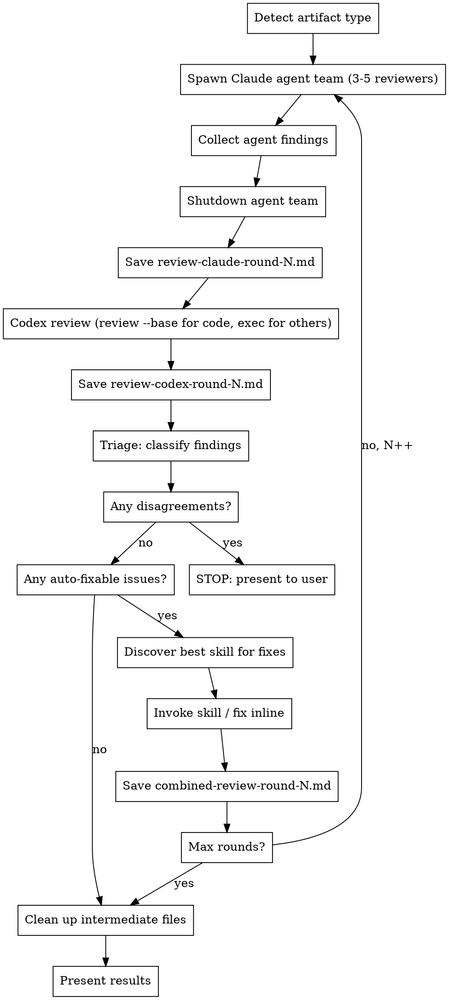

# Cross-Review Loop: Claude x Codex CLI

## Overview

Autonomous review-fix loop between Claude and Codex CLI. Each round: both review → triage findings → fix using the best available skill → repeat. Stops when clean, when reviewers disagree, or after max rounds.

## Prerequisites

- Codex CLI installed: `npm install -g @openai/codex`
- Codex authenticated: `codex auth login`
- Config at `~/.codex/config.toml` with model and reasoning effort set (model name is configurable — use whichever Codex model is available)

```toml
# ~/.codex/config.toml (example — adjust model to your available version)
model = "gpt-5.3-codex"
model_reasoning_effort = "xhigh"
```

## Checklist

Execute each of these steps sequentially, completing one before moving to the next:

1. **Detect artifact type** — determine what is being reviewed (plan, code, architecture, design)
2. **Run review round** — Claude reviews, then Codex reviews, then synthesize and triage
3. **Apply fixes** — discover best skill, invoke it to fix auto-fixable issues
4. **Check exit conditions** — disagreements? all clean? max rounds? decide whether to loop or stop
5. **Present results** — show user final state, remaining issues, or decisions needed
6. **Clean up intermediate files** — ALWAYS delete all review round files (mandatory, regardless of exit reason)

## Core Workflow



## Step 1: Detect Artifact Type

Examine the target file(s) to classify:

| Signal | Artifact Type |
|--------|---------------|
| `*-plan*.md`, `*implementation-plan*`, `*-tasks*` | **Plan** |
| `*-design*.md`, `*-architecture*`, `*-spec*` | **Architecture** |
| `*.cs`, `*.ts`, `*.py`, `*.js`, `*.go`, `*.rs` (source files) | **Code** |
| Other `*.md` in `docs/` or `plans/` | **Design Doc** |

Set `ARTIFACT_TYPE` for use in skill discovery later.

## Step 2: Run Review Round

### Claude Review (Agent Team)

Create an agent team to review the target artifact(s). Spawn specialized reviewer agents in parallel — each focused on a different angle — then collect and synthesize their findings.

**Core reviewers** (always spawn these three):

| Agent Name | Focus | Subagent Type |
|------------|-------|---------------|
| `security-reviewer` | Auth, injection, validation, secrets, data exposure | `general-purpose` |
| `performance-reviewer` | Bottlenecks, N+1 queries, memory leaks, scalability | `general-purpose` |
| `test-reviewer` | Test coverage gaps, missing edge cases, flaky test risks | `general-purpose` |

**Additional reviewers** (spawn when the artifact warrants it, up to 5 total):

| Agent Name | When to Spawn | Focus |
|------------|---------------|-------|
| `architect-reviewer` | Complex multi-component changes, new systems | Patterns, separation of concerns, scalability, deployment |
| `requirements-reviewer` | Plan or spec artifacts, feature implementations | Requirements coverage, completeness, missing acceptance criteria |

Use the Task tool to spawn each reviewer as a background agent in an agent team. Each reviewer agent prompt should:
1. Receive the target file path(s) to review
2. Know this is Round N (and if N > 1, only review the delta from Round N-1 fixes)
3. Output findings in the severity format below
4. Return a summary message with its findings

**Team spawning pattern:**

```
TeamCreate: team_name = "cross-review-round-N"

For each reviewer, use Task tool with:
  - subagent_type: "general-purpose"
  - team_name: "cross-review-round-N"
  - name: "<agent-name>"
  - run_in_background: true
  - prompt: |
      You are a <focus area> reviewer. Review these files: <file list>.
      This is Round N. <If N > 1: Only review changes from the previous fix round.>

      Structure your findings as:
      ### Critical Issues (blocks progress)
      ### High Issues (causes bugs or architectural problems)
      ### Medium Issues (quality, consistency)
      ### Minor Issues (nice to have)

      Be specific: reference file paths, line numbers, and concrete examples.
```

After all agents report back, synthesize their findings into a single review document.

Ensure the output directory `docs/plans/` exists (create if necessary). Save to: `docs/plans/review-claude-round-N.md`

Use this structure:
```markdown
# Cross-Review Round N — Claude (Agent Team)
**Target:** <file(s)>
**Date:** <date>
**Scope:** <full review | delta from Round N-1>
**Reviewers:** <list of agents spawned>

## Security Review
### Critical Issues (blocks progress)
### High Issues
### Medium Issues
### Minor Issues

## Performance Review
### Critical Issues (blocks progress)
### High Issues
### Medium Issues
### Minor Issues

## Test Coverage Review
### Critical Issues (blocks progress)
### High Issues
### Medium Issues
### Minor Issues

## <Additional Reviewer Section(s) if spawned>
...
```

After saving the review file, shut down the agent team for this round.

**Note on output format:** Claude's review groups findings by reviewer area (Security → severity, Performance → severity, etc.) because each agent reports independently. Codex's review uses global severity-first grouping. The triage step (Step 3) reconciles both formats by extracting individual findings and classifying them regardless of how they were grouped in the source reviews.

### Codex Review (Multi-Agent)

Run Codex CLI using its multi-agent feature to spawn parallel specialized reviewers — mirroring the Claude agent team approach for a true cross-validation.

**Prerequisites:** Ensure multi-agent is enabled in Codex config:

```toml
# ~/.codex/config.toml
[features]
multi_agent = true
```

Optionally define reviewer roles in the config or a project-level `.codex/config.toml`:

```toml
[agents.security-reviewer]
description = "Find security vulnerabilities, auth issues, injection risks, and data exposure."
config_file = "agents/reviewer.toml"

[agents.performance-reviewer]
description = "Find performance bottlenecks, N+1 queries, memory leaks, and scalability issues."
config_file = "agents/reviewer.toml"

[agents.test-reviewer]
description = "Find test coverage gaps, missing edge cases, and flaky test risks."
config_file = "agents/reviewer.toml"
```

Where `agents/reviewer.toml` contains:

```toml
model = "gpt-5.3-codex"
model_reasoning_effort = "high"
developer_instructions = "Focus on high priority issues. Be specific: reference file paths, line numbers, and concrete examples."
```

Assemble the review prompt in three steps — a constant base prompt, an artifact-type fragment, and round-specific context — then pass it to Codex. This avoids heredoc issues across shell environments (bash, PowerShell, MINGW) and separates concerns so each part can be iterated independently.

**Step A — Write the base prompt** (constant across all artifact types and rounds):

```bash
cat > /tmp/codex-review-base.txt <<'BASE'
You are a senior engineer performing an independent technical review.
Deliver concrete findings, not plans to produce findings.
Do not ask for clarification — make reasonable assumptions and proceed.

Before any tool call, identify ALL files you need to read.
Batch-read them in a single parallel request — never read sequentially
when parallelization is feasible.

Skip preamble, acknowledgments, and status updates.
Be terse and direct — optimize for information density.
Lead with the most severe findings first.

Spawn one agent per review focus area, wait for all of them, and
produce a single consolidated review.

Review focus areas:
1. Security — auth, injection, validation, secrets, data exposure
2. Performance — bottlenecks, N+1 queries, memory, scalability
3. Test coverage — missing tests, edge cases, flaky test risks
4. Correctness — bugs, logic errors, off-by-one, race conditions
5. Maintainability — patterns, readability, coupling

Quality criteria to check (applies to all artifact types):
- Internal consistency: no contradictions between sections or components
- Conventions: flag deviations from patterns established in surrounding work
- Risky shortcuts: speculative changes, untested assumptions, missing rationale
- Completeness: identify gaps where expected content or handling is absent

Structure findings GLOBALLY by severity, not grouped by area:

### Critical Issues (blocks progress)
- [category] File:line — description (for code; use section/heading for docs)

### High Issues (causes bugs or architectural problems)
- [category] File:line — description

### Medium Issues (quality, consistency)
- [category] File:line — description

### Minor Issues (nice to have)
- [category] File:line — description

Then add:
### Agreements with Claude's Review
### Disagreements with Claude's Review

For each disagreement with Claude's review, you MUST cite:
1. The specific code or line that supports your position
2. The concrete behavioral consequence (what breaks, what is missed)
3. Why Claude's assessment is incorrect or incomplete
Do not disagree on opinion or style — only on verifiable technical grounds.
BASE
```

**Step B — Write artifact-type prompt fragment** (one per type — use the full variants from the "Adapting for Different Artifacts" section below, not this abbreviated example):

```bash
# Write the artifact-type fragment matching ARTIFACT_TYPE
# Full fragments for each type are defined in "Adapting for Different Artifacts"
# Example: for code artifacts, write /tmp/codex-review-code.txt
# Example: for plan artifacts, write /tmp/codex-review-plan.txt
```

**Step C — Assemble the round-specific prompt and run Codex:**

For **code artifacts**, use `codex review --base` as the primary command:

```bash
# Assemble full prompt
cat /tmp/codex-review-base.txt > /tmp/codex-review-prompt.txt
cat /tmp/codex-review-code.txt >> /tmp/codex-review-prompt.txt
cat >> /tmp/codex-review-prompt.txt <<ROUND
Files to review: <target file(s)>
Claude's review: docs/plans/review-claude-round-N.md
Round: N
<If N > 1: Only review changes since Round N-1. Do not re-report fixed issues.>
Write the full review to: docs/plans/review-codex-round-N.md
ROUND

# Run Codex review (primary path for code artifacts)
# codex review outputs to stdout; --full-auto and -o are codex exec flags only
cat /tmp/codex-review-prompt.txt | codex review --base main - \
  > docs/plans/review-codex-round-N.md
```

For **non-code artifacts** (plans, architecture, design docs), use `codex exec`:

```bash
# Assemble full prompt (same pattern, different artifact-type file)
cat /tmp/codex-review-base.txt > /tmp/codex-review-prompt.txt
cat /tmp/codex-review-${ARTIFACT_TYPE}.txt >> /tmp/codex-review-prompt.txt
cat >> /tmp/codex-review-prompt.txt <<ROUND
Files to review: <target file(s)>
Claude's review: docs/plans/review-claude-round-N.md
Round: N
<If N > 1: Only review changes since Round N-1. Do not re-report fixed issues.>
Write the full review to: docs/plans/review-codex-round-N.md
ROUND

# Run Codex exec (fallback for non-code artifacts)
codex exec \
  -C /path/to/project \
  --full-auto \
  -o docs/plans/review-codex-round-N.md \
  "$(cat /tmp/codex-review-prompt.txt)"
```

**Note:** The `-m` flag is optional if your `~/.codex/config.toml` already specifies the model.

**Important:**
- `codex review` is already non-interactive — no `--full-auto` needed. Use `--full-auto` only with `codex exec` (non-code artifacts)
- Always pass Claude's review to Codex for cross-validation
- The multi-agent prompt tells Codex to spawn one agent per focus area automatically
- Use `/agent` in Codex CLI to inspect individual agent threads if needed
- Codex consolidates all agent results before writing the final review file

## Step 3: Triage Findings

After both reviews complete, synthesize and classify EVERY finding:

### Classification Rules

For each unique finding across both reviews:

**auto-fixable** — Both reviewers agree the issue exists AND the fix is unambiguous:
- Both identify the same problem (even if worded differently)
- The fix is a specific, concrete change (not a design decision)
- No trade-offs or alternative approaches to weigh

**needs-decision** — ANY of these conditions:
- Reviewers disagree on whether it's an issue
- Reviewers disagree on severity (e.g., Claude says Medium, Codex says High)
- Reviewers propose different fixes for the same issue
- The fix requires choosing between approaches
- The fix has side effects or trade-offs

**informational** — Both rate as Minor AND no concrete action is needed:
- Style preferences
- "Could be improved" without clear harm from current state
- Observations with no actionable fix

### Output Format

Save to `docs/plans/combined-review-round-N.md`:

```markdown
# Combined Review Round N

## Triage Summary
| Finding | Claude | Codex | Classification | Action |
|---------|--------|-------|----------------|--------|
| ...     | ...    | ...   | auto-fixable   | Fix X  |
| ...     | ...    | ...   | needs-decision | ...    |

## Auto-Fixable Issues
<list with specific fix actions>

## Needs Decision (BLOCKING)
<list with both perspectives, presented for user judgment>

## Informational
<list, no action needed>
```

## Step 4: Apply Fixes via Skill Discovery

### Dynamic Skill Discovery

Search the available skills listing for the best match based on `ARTIFACT_TYPE`:

**Plan artifacts** — search for skills with these keywords in name or description:
- `writing-plans`, `executing-plans`, `plan`

**Architecture artifacts** — search for:
- `architect`, `architecture`, `brainstorming`, `design`

**Code artifacts** — search for:
- `coder`, `code-review`, `implementation`, `feature-dev`
- Prefer project-specific skills (e.g., `unity-coder` over `feature-dev`)

**Design doc artifacts** — search for:
- `brainstorming`, `writing-plans`, `design`

### Skill Selection Priority

1. Project-specific skills first (e.g., `unity-coder`, `unity-architect`)
2. General-purpose skills second (e.g., `writing-plans`, `brainstorming`)
3. If no matching skill found AND fixes are trivial → apply inline (direct edits)
4. If no matching skill found AND fixes are non-trivial → STOP, ask user

### Applying Fixes

When invoking the discovered skill:
- Pass the list of auto-fixable findings as context
- The skill handles the actual edits according to its own workflow
- After the skill completes, verify the fixes were applied

When fixing inline (no skill available):
- Apply each fix directly using Edit tool
- Keep changes minimal and focused on the specific findings

## Step 5: Check Exit Conditions

After each round, evaluate in order:

1. **Disagreements found in triage?** → **EXIT LOOP**. Proceed to Step 6 to present the `needs-decision` items with both perspectives, then Step 7 to clean up.

2. **All issues resolved?** (no auto-fixable or needs-decision items remain) → **EXIT LOOP**. Proceed to Step 6 to present summary of all rounds and final state, then Step 7 to clean up.

3. **Max rounds reached?** (default: 3) → **EXIT LOOP**. Proceed to Step 6 to present remaining issues, then Step 7 to clean up.

4. **No skill available for non-trivial fixes?** → **EXIT LOOP**. Proceed to Step 6 to ask the user which skill to use, then Step 7 to clean up.

If none of the above → **increment N and loop back to Step 2**.

**CRITICAL: Every exit path leads to Step 6 (present results) then Step 7 (cleanup). Never skip cleanup.**

## Step 6: Present Results

When the loop exits, present a clear summary:

```markdown
## Cross-Review Complete

**Rounds:** N
**Exit reason:** <all clean | disagreement | max rounds | no skill>

### Resolved Issues
<list of issues fixed across all rounds>

### Remaining Issues (if any)
<needs-decision items with both perspectives>

### Decisions Needed (if any)
<specific questions for the user, with context from both reviewers>
```

## Step 7: Clean Up Intermediate Files (MANDATORY)

**This step is MANDATORY and runs regardless of why the loop exited.** Intermediate review files are working artifacts, not deliverables. Always delete them unless the user explicitly asked to keep them.

Delete all review round files:

```bash
rm -f docs/plans/review-claude-round-*.md \
      docs/plans/review-codex-round-*.md \
      docs/plans/combined-review-round-*.md
```

Also clean up any temp files used for Codex prompts:
```bash
rm -f /tmp/codex-review-base.txt \
      /tmp/codex-review-code.txt \
      /tmp/codex-review-plan.txt \
      /tmp/codex-review-architecture.txt \
      /tmp/codex-review-design.txt \
      /tmp/codex-review-prompt.txt
```

If the `docs/plans/` directory is empty after cleanup, remove it too:
```bash
rmdir docs/plans/ 2>/dev/null; rmdir docs/ 2>/dev/null
```

**Do NOT delete** the target artifact files that were reviewed — only the review round files.
**Do NOT skip this step** — leaving intermediate files is a known failure mode.

## Iteration Rules

- **Max 3 rounds** default — override by user instruction only
- **Round N+1 only reviews delta** — changes from Round N fixes, not full re-review
- **Each round produces 3 files:** `review-claude-round-N.md`, `review-codex-round-N.md`, `combined-review-round-N.md`
- **All intermediate files are deleted** after the review loop completes (Step 7 — mandatory regardless of exit reason)
- **Never silently resolve disagreements** — any reviewer conflict stops the loop
- **Skill invocation is per-round** — re-discover skills each round (available skills may change)
- **Agent teams are per-round** — create a new agent team for each Claude review round, shut it down after collecting results
- **Codex multi-agent is per-round** — each Codex invocation (`codex review` or `codex exec`) spawns its own sub-agents for that round

## Adapting for Different Artifacts

Each artifact type has a dedicated prompt fragment written to a temp file during Step B of prompt assembly. Write the appropriate file based on `ARTIFACT_TYPE` before assembling the round-specific prompt.

### Code Review

**Primary command:** `codex review --base main` (purpose-built for code review, produces better results than `codex exec`).

```bash
cat > /tmp/codex-review-code.txt <<'ARTIFACT'
Additional review focus for code:
- Type safety: unnecessary casts, missing type guards, `any` usage, incorrect generics, missing null checks
- Error handling: broad try/catch, swallowed errors, missing propagation, unhandled promise rejections
- Codebase conventions: naming, patterns, helpers — flag deviations from surrounding code
- Risky shortcuts: speculative changes, messy hacks, untested assumptions, TODO/FIXME debt
- Edge cases: boundary conditions, off-by-one errors, empty collections, negative values
- Dependencies: flag new imports that seem unnecessary or duplicative
ARTIFACT
```

### Plan Review

```bash
cat > /tmp/codex-review-plan.txt <<'ARTIFACT'
Additional review focus for plans:
- Completeness: every requirement maps to at least one task
- Task ordering: dependencies form a valid DAG with no cycles
- Dependency correctness: no missing or circular dependencies
- Missing tasks: gaps between requirements and planned work
- Requirement coverage: all acceptance criteria are addressed
- Feasibility: estimates are realistic given scope and constraints
ARTIFACT
```

### Architecture Review

```bash
cat > /tmp/codex-review-architecture.txt <<'ARTIFACT'
Additional review focus for architecture:
- Patterns: consistency across components, appropriate pattern usage
- Separation of concerns: clear boundaries, no leaking abstractions
- Scalability: bottlenecks, single points of failure, growth constraints
- Deployment constraints: environment compatibility, configuration management
- Tight coupling: identify components that should be decoupled
- Missing abstractions: places where an interface or abstraction layer is needed
ARTIFACT
```

### Design Doc Review

```bash
cat > /tmp/codex-review-design.txt <<'ARTIFACT'
Additional review focus for design documents:
- Requirements coverage: every requirement is addressed in the design
- Technical feasibility: proposed approach is implementable with stated constraints
- Scope creep: features or complexity beyond stated requirements
- Missing decisions: unresolved trade-offs, unstated assumptions
- Decision rationale: every decision has stated rationale and alternatives considered
ARTIFACT
```

## Common Mistakes

- Running `codex exec` without `--full-auto` causes it to hang waiting for approval (`codex review` is already non-interactive)
- Not passing Claude's review to Codex means no cross-validation
- Skipping triage and just applying both reviews leads to contradictory fixes
- Reviewing the same issues each round instead of only deltas
- Resolving disagreements without user input — this is the #1 error to avoid
- Hardcoding skill names instead of discovering them dynamically
- Forgetting to check if a discovered skill actually exists before invoking it
- Using heredoc syntax directly in `codex exec` on Windows/MINGW — use a temp file instead
- Forgetting to enable `multi_agent = true` in Codex config before expecting multi-agent behavior
- Not shutting down the Claude agent team after collecting results — leaks resources across rounds
- Leaving intermediate review round files in `docs/plans/` after the review completes — Step 7 cleanup is MANDATORY on every exit path, including early exits from disagreements or max rounds
- Spawning too few Claude reviewers (always spawn at least 3: security, performance, test coverage)
- Spawning too many reviewers for trivial changes — 3 is the baseline, only add more when complexity warrants it
- Letting Codex open with preamble or acknowledgment — wastes output tokens and dilutes findings
- Grouping Codex findings by review area instead of by severity — buries critical issues under area headings; Codex output should always use global severity-first grouping (Claude's review intentionally groups by area since each agent reports independently)
- Vague disagreements without code citations — "I disagree because..." without file:line evidence is noise; require concrete behavioral consequences
- Not telling Codex to batch-read files in parallel — causes sequential reads that waste time and tokens
- Using `codex exec` for code artifacts when `codex review --base` is available — the review command is purpose-built and produces better results
