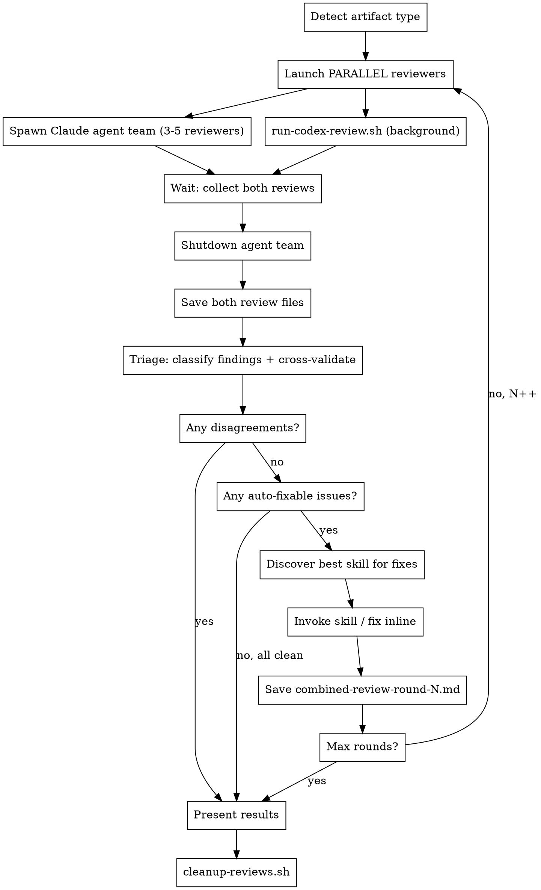

# Cross-Review Loop: Claude x Codex CLI

## Overview

Autonomous review-fix loop between Claude and Codex CLI. Each round: both review **simultaneously and independently** → triage findings → fix using the best available skill → repeat. Stops when clean, when reviewers disagree, or after max rounds.

## Prerequisites

- Codex CLI installed: `npm install -g @openai/codex`
- Codex authenticated: `codex auth login`
- Config at `~/.codex/config.toml` with model, reasoning effort, and multi-agent enabled:

```toml
# ~/.codex/config.toml (example — adjust model to your available version)
model = "gpt-5.4"
model_reasoning_effort = "xhigh"

[features]
multi_agent = true
```

Optionally define reviewer roles for richer multi-agent code review:

```toml
[agents.security-reviewer]
description = "Find security vulnerabilities, auth issues, injection risks, and data exposure."
config_file = "agents/reviewer.toml"

[agents.performance-reviewer]
description = "Find performance bottlenecks, N+1 queries, memory leaks, and scalability issues."
config_file = "agents/reviewer.toml"

[agents.test-reviewer]
description = "Find test coverage gaps, missing edge cases, and flaky test risks."
config_file = "agents/reviewer.toml"
```

Where `agents/reviewer.toml` contains:

```toml
model = "gpt-5.4"
model_reasoning_effort = "high"
developer_instructions = "Focus on high priority issues. Be specific: reference file paths, line numbers, and concrete examples."
```

- Claude Code agent teams enabled (experimental feature):
  - Set `CLAUDE_CODE_EXPERIMENTAL_AGENT_TEAMS=1` in environment or in `settings.json` under `"env"`
  - See the `agent-teams` plugin for full setup details

## Checklist

Execute each of these steps sequentially, completing one before moving to the next:

1. **Detect artifact type** — determine what is being reviewed (plan, code, architecture, design)
2. **Run review round** — launch Claude agents AND Codex simultaneously in parallel, then collect both results
3. **Triage findings** — classify and cross-validate findings from both reviewers
4. **Apply fixes** — discover best skill, invoke it to fix auto-fixable issues
5. **Check exit conditions** — disagreements? all clean? max rounds? decide whether to loop or stop
6. **Present results** — show user final state, remaining issues, or decisions needed
7. **Clean up intermediate files** — run `bash "${CLAUDE_PLUGIN_ROOT}/scripts/cleanup-reviews.sh" <output_dir>` (mandatory, regardless of exit reason)

## Core Workflow



## Step 1: Detect Artifact Type

Examine the target file(s) to classify:

| Signal | Artifact Type |
|--------|---------------|
| `*-plan*.md`, `*implementation-plan*`, `*-tasks*` | **Plan** |
| `*-design*.md`, `*-architecture*`, `*-spec*` | **Architecture** |
| `*.cs`, `*.ts`, `*.py`, `*.js`, `*.go`, `*.rs` (source files) | **Code** |
| Other `*.md` in `docs/` or `plans/` | **Design Doc** |

Set `ARTIFACT_TYPE` for use in skill discovery and Codex script invocation.

## Step 2: Run Review Round (PARALLEL)

**CRITICAL: Launch Claude agents and Codex simultaneously. Do NOT wait for one before starting the other.** Both review independently; cross-validation happens during Triage.

### 2a. Launch Codex (Background)

Run Codex via the plugin script as a **background bash process** (`run_in_background: true`):

**For code artifacts:**
```bash
bash "${CLAUDE_PLUGIN_ROOT}/scripts/run-codex-review.sh" code <ROUND> docs/plans /path/to/project main
```

The script runs `codex review --base main` — purpose-built for code review with multi-agent support. No custom prompt is passed (`--base` and `[PROMPT]` are mutually exclusive in Codex CLI). **Note:** This always reviews the full branch diff, not just changes from the previous fix round. Previously-fixed issues should not reappear, but Codex may surface new findings in unchanged code.

**For non-code artifacts:**
```bash
bash "${CLAUDE_PLUGIN_ROOT}/scripts/run-codex-review.sh" <plan|architecture|design> <ROUND> docs/plans /path/to/project target-file1.md target-file2.md
```

The script assembles a prompt from `prompts/codex-base.txt` + artifact-specific fragment, then runs `codex exec --full-auto` with stdout redirected to the output file. The base prompt instructs Codex to spawn one agent per review focus area (requires `multi_agent = true` in config).

### 2b. Launch Claude Agent Team (Parallel with Codex)

Spawn the Claude agent team **in the same turn** as launching Codex. Do not wait for Codex.

**Core reviewers** (always spawn these three):

| Agent Name | Focus | Subagent Type |
|------------|-------|---------------|
| `security-reviewer` | Auth, injection, validation, secrets, data exposure | `general-purpose` |
| `performance-reviewer` | Bottlenecks, N+1 queries, memory leaks, scalability | `general-purpose` |
| `test-reviewer` | Test coverage gaps, missing edge cases, flaky test risks | `general-purpose` |

**Additional reviewers** (spawn when the artifact warrants it, up to 5 total):

| Agent Name | When to Spawn | Focus |
|------------|---------------|-------|
| `architect-reviewer` | Complex multi-component changes, new systems | Patterns, separation of concerns, scalability, deployment |
| `requirements-reviewer` | Plan or spec artifacts, feature implementations | Requirements coverage, completeness, missing acceptance criteria |

Use the Agent tool to spawn each reviewer as a background agent in an agent team. Always use `model: "opus"`. Each reviewer prompt should:
1. Receive the target file path(s) to review
2. Know this is Round N (and if N > 1, focus on changes from Round N-1 fixes — use `git diff` to identify the delta for code artifacts)
3. Output findings in severity format (Critical / High / Medium / Minor)
4. Return a summary message with its findings

**Team spawning pattern:**

```
TeamCreate: team_name = "cross-review-round-N"

For each reviewer, use Agent tool with:
  - subagent_type: "general-purpose"
  - model: "opus"
  - team_name: "cross-review-round-N"
  - name: "<agent-name>"
  - run_in_background: true
  - prompt: |
      You are a <focus area> reviewer. Review these files: <file list>.
      This is Round N. <If N > 1: Only review changes from the previous fix round.>

      Structure your findings as:
      ### Critical Issues (blocks progress)
      ### High Issues (causes bugs or architectural problems)
      ### Medium Issues (quality, consistency)
      ### Minor Issues (nice to have)

      Be specific: reference file paths, line numbers, and concrete examples.
```

### 2c. Collect Both Reviews

After launching both in parallel:
1. Wait for all Claude agent messages to arrive, synthesize into `docs/plans/review-claude-round-N.md`
2. Wait for the Codex background bash job to complete using TaskOutput (do NOT just read the file — you must consume the background task so the completion notification doesn't arrive later), then **verify** the output file:
   - Read `docs/plans/review-codex-round-N.md` and confirm it contains the expected severity headers (`### Critical Issues`, `### High Issues`, etc.)
   - If the file is missing, empty, or contains only a brief summary (e.g., "Review written to..." or a one-paragraph synopsis without severity headers), **reconstruct from TaskOutput**: the script uses `tee` to send output to both the file and stdout, so the full review is available in TaskOutput even if the file is truncated
   - This fallback is necessary because Codex multi-agent mode may produce truncated output in some configurations
3. Shut down the Claude agent team for this round

**Claude review file structure:**
```markdown
# Cross-Review Round N — Claude (Agent Team)
**Target:** <file(s)>
**Date:** <date>
**Scope:** <full review | delta from Round N-1>
**Reviewers:** <list of agents spawned>

## Security Review
### Critical / High / Medium / Minor Issues

## Performance Review
### Critical / High / Medium / Minor Issues

## Test Coverage Review
### Critical / High / Medium / Minor Issues
```

**Note on output format:** Claude's review groups findings by reviewer area (Security → severity, Performance → severity, etc.) because each agent reports independently. Codex's review uses global severity-first grouping. The triage step reconciles both formats.

## Step 3: Triage Findings

After both reviews complete, synthesize and classify EVERY finding. **This is where cross-validation happens** — compare the two independent reviews to find where they agree and disagree.

### Classification Rules

For each unique finding across both reviews:

**auto-fixable** — Both reviewers agree the issue exists AND the fix is unambiguous:
- Both identify the same problem (even if worded differently)
- The fix is a specific, concrete change (not a design decision)
- No trade-offs or alternative approaches to weigh

**needs-decision** — ANY of these conditions:
- Reviewers disagree on whether it's an issue
- Reviewers disagree on severity (e.g., Claude says Medium, Codex says High)
- Reviewers propose different fixes for the same issue
- The fix requires choosing between approaches
- The fix has side effects or trade-offs

**informational** — Both rate as Minor AND no concrete action is needed

### Output Format

Save to `docs/plans/combined-review-round-N.md`:

```markdown
# Combined Review Round N

## Cross-Validation Summary
### Agreements (both reviewers flagged)
- [severity] description — Claude: <finding>, Codex: <finding>

### Disagreements (reviewers conflict)
- description — Claude: <position>, Codex: <position>

## Triage Summary
| Finding | Claude | Codex | Classification | Action |
|---------|--------|-------|----------------|--------|
| ...     | ...    | ...   | auto-fixable   | Fix X  |
| ...     | ...    | ...   | needs-decision | ...    |

## Auto-Fixable Issues
<list with specific fix actions>

## Needs Decision (BLOCKING)
<list with both perspectives, presented for user judgment>

## Informational
<list, no action needed>
```

## Step 4: Apply Fixes via Skill Discovery

### Dynamic Skill Discovery

Search the available skills listing for the best match based on `ARTIFACT_TYPE`:

| Artifact Type | Search Keywords |
|---------------|-----------------|
| **Plan** | `writing-plans`, `executing-plans`, `plan` |
| **Architecture** | `architect`, `architecture`, `brainstorming`, `design` |
| **Code** | `coder`, `code-review`, `implementation`, `feature-dev` (prefer project-specific) |
| **Design Doc** | `brainstorming`, `writing-plans`, `design` |

### Skill Selection Priority

1. Project-specific skills first (e.g., `unity-coder`, `unity-architect`)
2. General-purpose skills second (e.g., `writing-plans`, `brainstorming`)
3. If no matching skill found AND fixes are trivial → apply inline (direct edits)
4. If no matching skill found AND fixes are non-trivial → STOP, ask user

### Applying Fixes

When invoking the discovered skill:
- Pass the list of auto-fixable findings as context
- The skill handles the actual edits according to its own workflow
- After the skill completes, verify the fixes were applied

When fixing inline (no skill available):
- Apply each fix directly using Edit tool
- Keep changes minimal and focused on the specific findings

## Step 5: Check Exit Conditions

After each round, evaluate in order:

1. **Disagreements found in triage?** → **EXIT LOOP**. Present `needs-decision` items, then clean up.
2. **All issues resolved?** → **EXIT LOOP**. Present summary, then clean up.
3. **Max rounds reached?** (default: 3) → **EXIT LOOP**. Present remaining issues, then clean up.
4. **No skill available for non-trivial fixes?** → **EXIT LOOP**. Ask user, then clean up.

If none of the above → **increment N and loop back to Step 2**.

**CRITICAL: Every exit path leads to Step 6 (present results) then Step 7 (cleanup). Never skip cleanup.**

## Step 6: Present Results

When the loop exits, present a clear summary:

```markdown
## Cross-Review Complete

**Rounds:** N
**Exit reason:** <all clean | disagreement | max rounds | no skill>

### Resolved Issues
<list of issues fixed across all rounds>

### Remaining Issues (if any)
<needs-decision items with both perspectives>

### Decisions Needed (if any)
<specific questions for the user, with context from both reviewers>
```

## Step 7: Clean Up Intermediate Files (MANDATORY)

Run the cleanup script — this is MANDATORY regardless of exit reason:

```bash
bash "${CLAUDE_PLUGIN_ROOT}/scripts/cleanup-reviews.sh" docs/plans
```

**Do NOT delete** the target artifact files that were reviewed — only the review round files.
**Do NOT skip this step** — leaving intermediate files is a known failure mode.

## Iteration Rules

- **Max 3 rounds** default — override by user instruction only
- **Round N+1 focuses on delta** — Claude agents use `git diff` to review only Round N changes; Codex code reviews cover the full branch diff but previously-fixed issues should not reappear; non-code Codex reviews receive a text instruction to focus on changes
- **Each round produces 3 files:** `review-claude-round-N.md`, `review-codex-round-N.md`, `combined-review-round-N.md`
- **All intermediate files are deleted** after the review loop completes (Step 7 — mandatory)
- **Never silently resolve disagreements** — any reviewer conflict stops the loop
- **Skill invocation is per-round** — re-discover skills each round (available skills may change)
- **Agent teams are per-round** — create a new agent team for each Claude review round, shut it down after collecting results
- **Codex is per-round** — each Codex invocation runs fresh for that round
- **Both reviewers start simultaneously** — never wait for one before launching the other

## Common Mistakes

- **Running Claude agents to completion before launching Codex** — both must start simultaneously; launch Codex script first with `run_in_background: true`, then spawn Claude team in the same turn
- **Combining `--base` with a prompt in `codex review`** — `codex review --base <BRANCH>` and `[PROMPT]` are mutually exclusive; the script handles this correctly, but if running manually, use `codex review --base main` alone
- **Passing Claude's review to Codex** — Codex runs in parallel and can't see Claude's review; cross-validation happens during Triage
- **Not enabling `multi_agent = true` in Codex config** — without it, Codex runs as a single agent instead of spawning specialized reviewers
- Running `codex exec` without `--full-auto` causes it to hang waiting for approval (`codex review` is already non-interactive)
- Skipping triage and just applying both reviews leads to contradictory fixes
- Reviewing the same issues each round instead of only deltas
- Resolving disagreements without user input — this is the #1 error to avoid
- Hardcoding skill names instead of discovering them dynamically
- Not shutting down the Claude agent team after collecting results — leaks resources across rounds
- Leaving intermediate review round files after the review completes — always run `cleanup-reviews.sh`
- Spawning too few Claude reviewers (always spawn at least 3: security, performance, test coverage)
- Spawning too many reviewers for trivial changes — 3 is the baseline, only add more when complexity warrants it
- **Responding to late background task notifications** — if a Codex background task completion notification arrives after the workflow has already finished (results presented, cleanup done), do NOT generate a user-facing response; the output was already consumed via the file. Silently acknowledge it
- **Codex output file contains only a summary instead of the full review** — when Codex spawns multiple agents, the `-o` flag captures the final consolidation response (often a brief summary like "Review written to [file]") rather than the full multi-agent output; the script uses `tee` to send output to both file and stdout, so the full review is available in TaskOutput as a fallback if the file appears truncated
