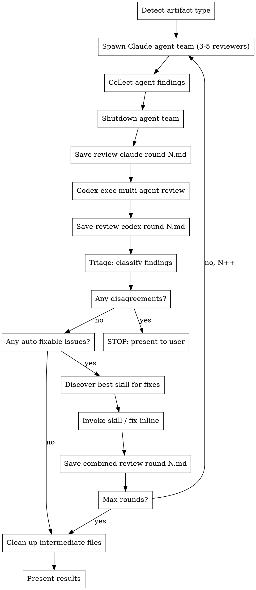

# Cross-Review Loop: Claude x Codex CLI

## Overview

Autonomous review-fix loop between Claude and Codex CLI. Each round: both review → triage findings → fix using the best available skill → repeat. Stops when clean, when reviewers disagree, or after max rounds.

## Prerequisites

- Codex CLI installed: `npm install -g @openai/codex`
- Codex authenticated: `codex auth login`
- Config at `~/.codex/config.toml` with model and reasoning effort set (model name is configurable — use whichever Codex model is available)

```toml
# ~/.codex/config.toml (example — adjust model to your available version)
model = "gpt-5.3-codex"
model_reasoning_effort = "xhigh"
```

## Checklist

Execute each of these steps sequentially, completing one before moving to the next:

1. **Detect artifact type** — determine what is being reviewed (plan, code, architecture, design)
2. **Run review round** — Claude reviews, then Codex reviews, then synthesize and triage
3. **Apply fixes** — discover best skill, invoke it to fix auto-fixable issues
4. **Check exit conditions** — disagreements? all clean? max rounds? decide whether to loop or stop
5. **Present results** — show user final state, remaining issues, or decisions needed

## Core Workflow



## Step 1: Detect Artifact Type

Examine the target file(s) to classify:

| Signal | Artifact Type |
|--------|---------------|
| `*-plan*.md`, `*implementation-plan*`, `*-tasks*` | **Plan** |
| `*-design*.md`, `*-architecture*`, `*-spec*` | **Architecture** |
| `*.cs`, `*.ts`, `*.py`, `*.js`, `*.go`, `*.rs` (source files) | **Code** |
| Other `*.md` in `docs/` or `plans/` | **Design Doc** |

Set `ARTIFACT_TYPE` for use in skill discovery later.

## Step 2: Run Review Round

### Claude Review (Agent Team)

Create an agent team to review the target artifact(s). Spawn specialized reviewer agents in parallel — each focused on a different angle — then collect and synthesize their findings.

**Core reviewers** (always spawn these three):

| Agent Name | Focus | Subagent Type |
|------------|-------|---------------|
| `security-reviewer` | Auth, injection, validation, secrets, data exposure | `general-purpose` |
| `performance-reviewer` | Bottlenecks, N+1 queries, memory leaks, scalability | `general-purpose` |
| `test-reviewer` | Test coverage gaps, missing edge cases, flaky test risks | `general-purpose` |

**Additional reviewers** (spawn when the artifact warrants it, up to 5 total):

| Agent Name | When to Spawn | Focus |
|------------|---------------|-------|
| `architect-reviewer` | Complex multi-component changes, new systems | Patterns, separation of concerns, scalability, deployment |
| `requirements-reviewer` | Plan or spec artifacts, feature implementations | Requirements coverage, completeness, missing acceptance criteria |

Use the Task tool to spawn each reviewer as a background agent in an agent team. Each reviewer agent prompt should:
1. Receive the target file path(s) to review
2. Know this is Round N (and if N > 1, only review the delta from Round N-1 fixes)
3. Output findings in the severity format below
4. Return a summary message with its findings

**Team spawning pattern:**

```
TeamCreate: team_name = "cross-review-round-N"

For each reviewer, use Task tool with:
  - subagent_type: "general-purpose"
  - team_name: "cross-review-round-N"
  - name: "<agent-name>"
  - run_in_background: true
  - prompt: |
      You are a <focus area> reviewer. Review these files: <file list>.
      This is Round N. <If N > 1: Only review changes from the previous fix round.>

      Structure your findings as:
      ### Critical Issues (blocks progress)
      ### High Issues (causes bugs or architectural problems)
      ### Medium Issues (quality, consistency)
      ### Minor Issues (nice to have)

      Be specific: reference file paths, line numbers, and concrete examples.
```

After all agents report back, synthesize their findings into a single review document.

Ensure the output directory `docs/plans/` exists (create if necessary). Save to: `docs/plans/review-claude-round-N.md`

Use this structure:
```markdown
# Cross-Review Round N — Claude (Agent Team)
**Target:** <file(s)>
**Date:** <date>
**Scope:** <full review | delta from Round N-1>
**Reviewers:** <list of agents spawned>

## Security Review
### Critical Issues (blocks progress)
### High Issues
### Medium Issues
### Minor Issues

## Performance Review
### Critical Issues (blocks progress)
### High Issues
### Medium Issues
### Minor Issues

## Test Coverage Review
### Critical Issues (blocks progress)
### High Issues
### Medium Issues
### Minor Issues

## <Additional Reviewer Section(s) if spawned>
...
```

After saving the review file, shut down the agent team for this round.

### Codex Review (Multi-Agent)

Run Codex CLI using its multi-agent feature to spawn parallel specialized reviewers — mirroring the Claude agent team approach for a true cross-validation.

**Prerequisites:** Ensure multi-agent is enabled in Codex config:

```toml
# ~/.codex/config.toml
[features]
multi_agent = true
```

Optionally define reviewer roles in the config or a project-level `.codex/config.toml`:

```toml
[agents.security-reviewer]
description = "Find security vulnerabilities, auth issues, injection risks, and data exposure."
config_file = "agents/reviewer.toml"

[agents.performance-reviewer]
description = "Find performance bottlenecks, N+1 queries, memory leaks, and scalability issues."
config_file = "agents/reviewer.toml"

[agents.test-reviewer]
description = "Find test coverage gaps, missing edge cases, and flaky test risks."
config_file = "agents/reviewer.toml"
```

Where `agents/reviewer.toml` contains:

```toml
model = "gpt-5.3-codex"
model_reasoning_effort = "high"
developer_instructions = "Focus on high priority issues. Be specific: reference file paths, line numbers, and concrete examples."
```

Write the review prompt to a temp file, then pass it to Codex. This avoids heredoc issues across shell environments (bash, PowerShell, MINGW):

```bash
# Write prompt to temp file (adapt paths and file references per round)
cat > /tmp/codex-review-prompt.txt <<'PROMPT'
I would like to cross-review the following artifact against Claude's findings.

Read these files:
1. <target artifact file(s)>
2. docs/plans/review-claude-round-N.md (Claude's agent team review - cross-validate)

Spawn one agent per review focus area, wait for all of them, and
summarize the result for each area:
1. Security implications — auth, injection, validation, secrets, data exposure
2. Performance impact — bottlenecks, N+1 queries, memory, scalability
3. Test coverage — missing tests, edge cases, flaky test risks
4. Code quality and correctness — bugs, logic errors, error handling
5. Maintainability — patterns, readability, coupling

For each area, structure findings as:
### Critical Issues (blocks progress)
### High Issues (causes bugs)
### Medium Issues (quality)
### Minor Issues (nice to have)

Then add a final consolidated section:
### Agreements with Claude's Review
### Disagreements with Claude's Review

For each disagreement, explain specifically why you disagree and what
evidence supports your position.

Write the full review to: docs/plans/review-codex-round-N.md
PROMPT

# Run Codex with the prompt file
codex exec \
  -C /path/to/project \
  --full-auto \
  -o docs/plans/review-codex-round-N.md \
  "$(cat /tmp/codex-review-prompt.txt)"
```

**Note:** The `-m` flag is optional if your `~/.codex/config.toml` already specifies the model.

**Important:**
- Always use `--full-auto` to prevent Codex from hanging on approval prompts
- Always pass Claude's review to Codex for cross-validation
- The multi-agent prompt tells Codex to spawn one agent per focus area automatically
- Use `/agent` in Codex CLI to inspect individual agent threads if needed
- Codex consolidates all agent results before writing the final review file
- Adapt the review prompt to match the artifact type (plan/code/architecture/design)

## Step 3: Triage Findings

After both reviews complete, synthesize and classify EVERY finding:

### Classification Rules

For each unique finding across both reviews:

**auto-fixable** — Both reviewers agree the issue exists AND the fix is unambiguous:
- Both identify the same problem (even if worded differently)
- The fix is a specific, concrete change (not a design decision)
- No trade-offs or alternative approaches to weigh

**needs-decision** — ANY of these conditions:
- Reviewers disagree on whether it's an issue
- Reviewers disagree on severity (e.g., Claude says Medium, Codex says High)
- Reviewers propose different fixes for the same issue
- The fix requires choosing between approaches
- The fix has side effects or trade-offs

**informational** — Both rate as Minor AND no concrete action is needed:
- Style preferences
- "Could be improved" without clear harm from current state
- Observations with no actionable fix

### Output Format

Save to `docs/plans/combined-review-round-N.md`:

```markdown
# Combined Review Round N

## Triage Summary
| Finding | Claude | Codex | Classification | Action |
|---------|--------|-------|----------------|--------|
| ...     | ...    | ...   | auto-fixable   | Fix X  |
| ...     | ...    | ...   | needs-decision | ...    |

## Auto-Fixable Issues
<list with specific fix actions>

## Needs Decision (BLOCKING)
<list with both perspectives, presented for user judgment>

## Informational
<list, no action needed>
```

## Step 4: Apply Fixes via Skill Discovery

### Dynamic Skill Discovery

Search the available skills listing for the best match based on `ARTIFACT_TYPE`:

**Plan artifacts** — search for skills with these keywords in name or description:
- `writing-plans`, `executing-plans`, `plan`

**Architecture artifacts** — search for:
- `architect`, `architecture`, `brainstorming`, `design`

**Code artifacts** — search for:
- `coder`, `code-review`, `implementation`, `feature-dev`
- Prefer project-specific skills (e.g., `unity-coder` over `feature-dev`)

**Design doc artifacts** — search for:
- `brainstorming`, `writing-plans`, `design`

### Skill Selection Priority

1. Project-specific skills first (e.g., `unity-coder`, `unity-architect`)
2. General-purpose skills second (e.g., `writing-plans`, `brainstorming`)
3. If no matching skill found AND fixes are trivial → apply inline (direct edits)
4. If no matching skill found AND fixes are non-trivial → STOP, ask user

### Applying Fixes

When invoking the discovered skill:
- Pass the list of auto-fixable findings as context
- The skill handles the actual edits according to its own workflow
- After the skill completes, verify the fixes were applied

When fixing inline (no skill available):
- Apply each fix directly using Edit tool
- Keep changes minimal and focused on the specific findings

## Step 5: Check Exit Conditions

After each round, evaluate in order:

1. **Disagreements found in triage?** → **STOP**. Present the `needs-decision` items to the user with both perspectives. Wait for user input before continuing.

2. **All issues resolved?** (no auto-fixable or needs-decision items remain) → **DONE**. Present summary of all rounds and final state.

3. **Max rounds reached?** (default: 3) → **STOP**. Present remaining issues to the user. If not converging, there may be a fundamental disagreement that needs human judgment.

4. **No skill available for non-trivial fixes?** → **STOP**. Ask the user which skill to use or whether to fix inline.

If none of the above → **increment N and loop back to Step 2**.

## Step 6: Present Results and Clean Up

When the loop exits, present a clear summary:

```markdown
## Cross-Review Complete

**Rounds:** N
**Exit reason:** <all clean | disagreement | max rounds | no skill>

### Resolved Issues
<list of issues fixed across all rounds>

### Remaining Issues (if any)
<needs-decision items with both perspectives>

### Decisions Needed (if any)
<specific questions for the user, with context from both reviewers>
```

### Clean Up Intermediate Files

After presenting the final summary, **delete all intermediate review files** produced during the review loop. These are working artifacts, not deliverables:

```
docs/plans/review-claude-round-*.md
docs/plans/review-codex-round-*.md
docs/plans/combined-review-round-*.md
```

Remove them using the Bash tool:
```bash
rm -f docs/plans/review-claude-round-*.md \
      docs/plans/review-codex-round-*.md \
      docs/plans/combined-review-round-*.md
```

Also clean up any temp files used for Codex prompts:
```bash
rm -f /tmp/codex-review-prompt.txt
```

**Do NOT delete** the target artifact files that were reviewed — only the review round files.

## Iteration Rules

- **Max 3 rounds** default — override by user instruction only
- **Round N+1 only reviews delta** — changes from Round N fixes, not full re-review
- **Each round produces 3 files:** `review-claude-round-N.md`, `review-codex-round-N.md`, `combined-review-round-N.md`
- **All intermediate files are deleted** after the review loop completes (Step 6)
- **Never silently resolve disagreements** — any reviewer conflict stops the loop
- **Skill invocation is per-round** — re-discover skills each round (available skills may change)
- **Agent teams are per-round** — create a new agent team for each Claude review round, shut it down after collecting results
- **Codex multi-agent is per-round** — each Codex exec spawns its own sub-agents for that round

## Adapting for Different Artifacts

### Plan Review
Focus: completeness, task ordering, dependency correctness, missing tasks, requirement coverage

### Code Review
For code, Codex can also use its built-in review command:
```bash
codex review --base main "Focus on security, correctness, and performance"
```
Focus: bugs, security, performance, patterns, edge cases

### Architecture Review
Focus: patterns, scalability, separation of concerns, deployment constraints, consistency

### Design Doc Review
Focus: requirements coverage, technical feasibility, scope creep, missing decisions

## Common Mistakes

- Running Codex without `--full-auto` causes it to hang waiting for approval
- Not passing Claude's review to Codex means no cross-validation
- Skipping triage and just applying both reviews leads to contradictory fixes
- Reviewing the same issues each round instead of only deltas
- Resolving disagreements without user input — this is the #1 error to avoid
- Hardcoding skill names instead of discovering them dynamically
- Forgetting to check if a discovered skill actually exists before invoking it
- Using heredoc syntax directly in `codex exec` on Windows/MINGW — use a temp file instead
- Forgetting to enable `multi_agent = true` in Codex config before expecting multi-agent behavior
- Not shutting down the Claude agent team after collecting results — leaks resources across rounds
- Leaving intermediate review round files in `docs/plans/` after the review completes — always clean up
- Spawning too few Claude reviewers (always spawn at least 3: security, performance, test coverage)
- Spawning too many reviewers for trivial changes — 3 is the baseline, only add more when complexity warrants it
